# AWS Certified Big Data - Specialty: Study Notebook

<div align="center">
    
</div>

My study and architecture notes for **AWS Certified Big Data - Specialty**, organised chapter by chapter. The six chapters follow the exam's six areas: collection, storage, processing, analysis, visualization and security. Each topic is written for beginners, one idea at a time, with small animated diagrams so the flow is easy to see.

## Where I am now

<!-- progress:summary:start -->
**Studying now:** [Amazon Kinesis Data Streams](chapter-01-collection/01-kinesis-data-streams/README.md)

🟩🟩🟨🟨🟨🟩🟩🟨🟩⬜🟩🟩🟩🟩⬜⬜⬜⬜⬜⬜

**9 of 20 topics complete · 4 in progress · 45%**

**Next up:** Hot shard and bad partition keys

[Read the notes](chapter-01-collection/01-kinesis-data-streams/README.md) · [Open the tracker](chapter-01-collection/01-kinesis-data-streams/TRACKER.md)
<!-- progress:summary:end -->

### What is covered so far

<!-- progress:concepts:start -->
**Written up in the notes:** [Why Kinesis exists](chapter-01-collection/01-kinesis-data-streams/README.md#4-do-you-always-need-kinesis) · [PUT and GET](chapter-01-collection/01-kinesis-data-streams/README.md#2-basic-kinesis-flow) · [Producer](chapter-01-collection/01-kinesis-data-streams/README.md#51-producer) · [Record](chapter-01-collection/01-kinesis-data-streams/README.md#52-record) · [Stream](chapter-01-collection/01-kinesis-data-streams/README.md#53-stream) · [Shard](chapter-01-collection/01-kinesis-data-streams/README.md#54-shard) · [Partition key](chapter-01-collection/01-kinesis-data-streams/README.md#55-partition-key) · [Sequence number](chapter-01-collection/01-kinesis-data-streams/README.md#56-sequence-number) · [Ordering](chapter-01-collection/01-kinesis-data-streams/README.md#6-ordering) · [Provisioned vs on-demand](chapter-01-collection/01-kinesis-data-streams/README.md#71-provisioned-or-on-demand) · [Shard capacity](chapter-01-collection/01-kinesis-data-streams/README.md#72-shard-capacity) · [Throttling](chapter-01-collection/01-kinesis-data-streams/README.md#73-throttling) · [PutRecord](chapter-01-collection/01-kinesis-data-streams/README.md#8-writing-data-putrecord-and-putrecords) · [PutRecords](chapter-01-collection/01-kinesis-data-streams/README.md#8-writing-data-putrecord-and-putrecords) · [Retention](chapter-01-collection/01-kinesis-data-streams/README.md#9-retention-and-replay) · [Replay](chapter-01-collection/01-kinesis-data-streams/README.md#9-retention-and-replay) · [Consumer-side reading](chapter-01-collection/01-kinesis-data-streams/README.md#101-consumer-side-reading) · [Consumer lag](chapter-01-collection/01-kinesis-data-streams/README.md#102-consumer-lag) · [Standard consumer](chapter-01-collection/01-kinesis-data-streams/README.md#103-standard-consumers-and-enhanced-fan-out) · [Enhanced fan-out](chapter-01-collection/01-kinesis-data-streams/README.md#103-standard-consumers-and-enhanced-fan-out)

**Understood, write-up pending:** Retention period · Recovering after a consumer failure · Provisioned vs on-demand: when to use each · Resharding: split and merge shards · Scaling up and scaling down
<!-- progress:concepts:end -->

## How the repository is organised

```text
AWS-Certified-Big-Data-Specialty/
├── README.md
├── progress.json                  <- the single source of truth for progress
├── scripts/update_progress.py     <- regenerates the tracker, README progress and study map
├── .github/workflows/update-progress.yml
├── assets/study-map.svg
├── chapter-01-collection/
│   └── 01-kinesis-data-streams/
│       ├── README.md              <- the notes, with animated diagrams and questions
│       ├── TRACKER.md             <- generated roadmap and progress
│       └── animations/
├── chapter-02-storage/
├── chapter-03-processing/
├── chapter-04-analysis/
├── chapter-05-visualization/
└── chapter-06-security/
```

Each topic folder follows the same pattern: a `README.md` with the explanation, an `animations/` folder with animated diagrams, and, when needed, `images/` and `examples/`.

## Progress

<!-- progress:chapters:start -->
| Chapter | Topic area | Status |
| :-: | --- | --- |
| 1 | Collection | 🔨 In progress |
| 2 | Storage | ⏳ Planned |
| 3 | Processing | ⏳ Planned |
| 4 | Analysis | ⏳ Planned |
| 5 | Visualization | ⏳ Planned |
| 6 | Security | ⏳ Planned |
<!-- progress:chapters:end -->

### Chapter 1: Collection

<!-- progress:topics:start -->
| # | Topic | Status |
| :-: | --- | --- |
| 1 | [Amazon Kinesis Data Streams](chapter-01-collection/01-kinesis-data-streams/README.md) ([tracker](chapter-01-collection/01-kinesis-data-streams/TRACKER.md)) | 🔨 In progress: 9 of 20 topics complete, 4 in progress |
| 2 | Kinesis Data Firehose | ⏳ Planned |
| 3 | Kinesis Agent | ⏳ Planned |
| 4 | AWS IoT Core | ⏳ Planned |
| 5 | IoT Rules Engine | ⏳ Planned |
| 6 | Sensor data | ⏳ Planned |
| 7 | Amazon SQS | ⏳ Planned |
<!-- progress:topics:end -->

## How progress updates itself

The tables, the progress bar and the study map above are **generated**. To change progress, edit [`progress.json`](progress.json) (for example set a topic's `status` to `done`) and commit. A GitHub Action then regenerates the tracker, these sections of this README and the study map. Nothing else needs touching.

## How to read it

Start with the topic README and read it from the top. New ideas are added one at a time, and each part builds on the one before it. The diagrams are animated SVGs, so they play right inside GitHub.
