# Kinesis Processing Engines: Lambda vs Managed Flink vs EMR/Spark vs EC2

> AWS Certified Big Data - Specialty · Chapter 1: Collection  
> Companion note for **Amazon Kinesis Data Streams** · Part of the [Kinesis notes](README.md) · [Tracker](TRACKER.md)  
> Goal: choose the right processing engine from the workload (scale, latency, state, complexity, operations and cost), not from the company name.

| | |
| --- | --- |
| **1.** [Big picture](#1-big-picture) | **9.** [Scenarios](#9-scenarios) |
| **2.** [AWS Lambda](#2-aws-lambda) | **10.** [Questions to ask before choosing](#10-questions-to-ask-before-choosing) |
| **3.** [Managed Service for Apache Flink](#3-amazon-managed-service-for-apache-flink) | **11.** [Senior interview questions](#11-senior-interview-questions) |
| **4.** [EMR + Spark](#4-amazon-emr--apache-spark) | **12.** [Scenario-based questions](#12-scenario-based-questions-senior-level) |
| **5.** [EC2 / ECS custom consumer](#5-ec2--ecs-custom-consumer) | **13.** [Interview trap questions](#13-interview-trap-questions) |
| **6.** [Decision matrix](#6-decision-matrix) | **14.** [Architect's selection rule](#14-architects-selection-rule) |
| **7.** [Decision flow](#7-architecture-decision-flow) | **15.** [Architecture exercise template](#15-architecture-exercise-template) |
| **8.** [Sizing a stream and its consumers](#8-sizing-a-stream-and-its-consumers) | **16.** [Official AWS references](#16-official-aws-references) |

> **How to read the numbers.** Limits and prices on AWS change. Every figure here is approximate and for reasoning. Check the current AWS documentation before sizing a real system.

---

## 1. Big picture

Kinesis Data Streams is the **streaming layer**. It receives events and retains them. A **processing engine** reads those events and does work on them.

<div align="center">
    
</div>

**What you are seeing**

1. Producers (apps, clickstream, IoT) write events into **one** Kinesis stream.
2. The same stream feeds **several independent branches**. None of them blocks the others.
3. **Lambda** reacts to individual events in milliseconds to seconds: alerts, small writes.
4. **Managed Flink** keeps state and windows for real-time analytics: seconds.
5. **Firehose** batches the stream into S3, and **EMR/Spark** processes that data lake in bulk: minutes to hours.
6. An **ECS (KCL) application** runs custom logic that the other engines cannot.

```text
Producer -- PUT --> Kinesis <-- READ -- Processing Engine --> Output
                                      |
                                      +-- Lambda
                                      +-- Managed Service for Apache Flink
                                      +-- EMR / Spark
                                      +-- EC2 / ECS custom application
```

**Two things that are not processing engines**

- **Kinesis Data Streams** only ingests and retains. It does not process.
- **Firehose** only **delivers** data (to S3 and other destinations), with light transformation. It is the right answer when you only need to land data, with no real processing.

The decision is **not based on the company name**. It is based on the workload:

- How many events per second, and how large is each event?
- How quickly must a result be produced?
- Is the processing stateless or stateful?
- Do we need windows (last 5 minutes, last hour) or joins between streams?
- Do we also need large-scale historical processing?
- How much operational control do we want, and what does it cost?

### How each engine reads Kinesis

| Engine | How it reads the stream | Who tracks the position |
| --- | --- | --- |
| **Lambda** | An **event source mapping** polls each shard and invokes your function with a batch | Lambda |
| **Managed Flink** | The Kinesis connector reads the shards inside the running application | Flink (checkpoints) |
| **Spark on EMR** | A Kinesis connector inside Spark Structured Streaming | Spark (checkpoint location) |
| **EC2 / ECS custom** | Your app, usually with the **Kinesis Client Library (KCL)** | KCL (leases and checkpoints in DynamoDB) |

All four can use **enhanced fan-out** where the connector supports it, so each gets its own read capacity (see [section 10.3 of the Kinesis notes](README.md#103-standard-consumers-and-enhanced-fan-out)).

---

## 2. AWS Lambda

<div align="center">
    
</div>

### Foundation

Lambda is **serverless compute**. With Kinesis, an **event source mapping** polls the stream, reads batches from the shards and invokes your function.

```text
Kinesis --> Event Source Mapping --> Lambda --> Output
```

**What you are seeing**

1. The mapping polls every shard and groups records into **batches**.
2. Each shard is handled in parallel: by default about **one invocation at a time per shard**.
3. If a batch fails, Lambda **retries it**. Order inside a shard is kept, so one bad batch can hold up its shard.
4. You tune this with batch size, retry limits, splitting the batch on error, partial batch response and a failure destination.

### Good fits

- Validate an event
- Enrich an event with lightweight logic
- Convert a JSON structure
- Filter events
- Send an alert
- Write selected events to another service
- Trigger downstream workflows

### Less suitable when

- Processing is continuously stateful
- Complex event-time windows are required
- Large joins or aggregations are required
- The code needs a permanently running custom runtime
- The workload behaves more like a streaming application than individual function executions

### Example

```text
Kinesis
  |
  v
Lambda
  |
  +--> Validate event
  +--> Add metadata
  +--> Store result
```

### The settings that matter

| Setting | What it does |
| --- | --- |
| **Batch size** | How many records go to one invocation (also limited by the invocation payload size) |
| **Batching window** | How long to wait to fill a batch before invoking |
| **Parallelization factor** | Process several batches from one shard at the same time (order kept per partition key) |
| **Starting position** | `LATEST`, `TRIM_HORIZON` or a timestamp |
| **Retry limits** | Maximum retry attempts and maximum record age |
| **Bisect on error** | Split a failing batch in two to isolate the bad record |
| **Partial batch response** | Report which records failed so only those are retried |
| **On-failure destination** | Send details of records that kept failing to a queue or topic |
| **Tumbling windows** | Simple stateful aggregation inside a short window |
| **Enhanced fan-out** | A dedicated read pipe for this consumer |

### What can go wrong

- A **poison record** that always fails keeps the batch retrying and **blocks that shard** until it expires or a retry limit is reached.
- **Downstream throttling** (for example the database cannot keep up) makes the function slow or fail, and the **iterator age** grows.
- Retries mean the same record can arrive twice, so the function must be **idempotent**.

### Cost model

You pay per invocation and per GB-second of run time, so it is **cheap for small or spiky traffic** and can become expensive for very high, sustained volumes of heavy work.

### Architecture question

**Requirement:** 5,000 small events/sec, and each event only needs schema validation and an API lookup.

**Likely choice:** Lambda, provided the concurrency, the downstream limits, the latency and the cost calculation all fit.

### Senior-level design considerations

- Batch size and batching window
- Parallelization factor
- Starting position: `LATEST`, `TRIM_HORIZON`, or timestamp where applicable
- Retry behavior
- Partial batch failure strategy
- Idempotency
- Consumer lag
- Enhanced fan-out vs shared throughput
- Downstream throttling
- Lambda concurrency
- Poison records

---

## 3. Amazon Managed Service for Apache Flink

> Older material may call this **Kinesis Data Analytics for Apache Flink**. The current AWS service name is **Amazon Managed Service for Apache Flink**.

<div align="center">
    
</div>

### Foundation

Flink is a **continuous stream-processing engine**. It is built for applications that stay running and process streaming records all the time.

```text
Kinesis --> Flink operators --> transformed stream / sink
```

Typical operations:

```text
filter
map
aggregate
window
join
enrich
stateful calculations
```

**What you are seeing**

1. Events arrive with their **own timestamps** (event time), not only the time they were received.
2. Flink groups them into **windows** (here 4-second windows) and keeps **running state per key** (A and B).
3. When the **watermark** (the green line) passes the end of a window, that window's result is **emitted**.
4. The state is **checkpointed** to durable storage, so after a failure the application resumes **without losing the counts**.

### Where Flink becomes powerful

Suppose a streaming platform sends:

```text
PLAY
PAUSE
BUFFER_START
BUFFER_END
QUALITY_CHANGE
```

and you want, every minute:

```text
buffering ratio per user
average playback quality
number of active sessions
abnormal buffering patterns
```

This is naturally a **continuous, stateful streaming problem**.

### Good fits

- Stateful stream processing
- Real-time aggregations
- Sliding, tumbling and session windows
- Stream-to-stream joins
- Event-time processing
- Real-time metrics
- Pattern and anomaly processing
- Long-running streaming applications

### Example

```text
Kinesis
   |
   v
Flink
   |
   +--> 5-minute window aggregation
   +--> session state
   +--> enrichment
   +--> real-time calculation
   |
   v
Output stream / DB / dashboard
```

### The ideas to know

| Idea | In one line |
| --- | --- |
| **Event time vs processing time** | When the event happened vs when you saw it |
| **Watermark** | Flink's estimate of how far event time has progressed, used to close windows |
| **Late events** | Events that arrive after their window closed; you choose to drop, allow or side-output them |
| **Keyed state** | Counts, sessions or other values Flink remembers per key |
| **Checkpoint** | A consistent snapshot of all state, used to recover after a failure |
| **Snapshot (savepoint)** | A deliberate snapshot used to upgrade or move an application without losing state |
| **Backpressure** | A slow operator or sink slows the whole pipeline instead of dropping data |
| **Parallelism / KPU** | How many parallel tasks run, and the unit AWS uses to size and bill the application |

### About "standard analysis" in older material

Older exam and course material describes **Kinesis Data Analytics with SQL**: you wrote SQL over a stream. AWS has announced it is retiring that SQL flavour, and the current way to get streaming SQL is **Flink SQL**, for example in Managed Service for Apache Flink notebooks. The concepts (windows over a stream, continuous queries) are the same. Check the AWS announcement for the exact dates.

### What can go wrong

- **State grows without limit** (for example a session that never closes), exhausting memory or storage.
- **Skewed keys**: one very busy key overloads one parallel task.
- A **slow sink** causes backpressure all the way back to the source, so the consumer lag grows.
- **End-to-end exactly-once** needs a sink that is transactional or idempotent. Flink's own state is exactly-once, but a sink that cannot join in can still produce duplicates.

### Cost model

You pay for the capacity the application runs on, **all the time it is running**, whether or not events are arriving. That is efficient for steady, heavy streaming and wasteful for rare events.

### Senior-level design considerations

- Event time vs processing time
- Watermarks and late events
- State size
- Checkpoints and recovery
- Parallelism
- Backpressure
- Source and sink throughput
- Exactly-once requirements and sink semantics
- Key selection and partitioning
- Application scaling
- Deployment upgrades and state compatibility

---

## 4. Amazon EMR + Apache Spark

<div align="center">
    
</div>

### Foundation

**Apache Spark** is the processing engine. **Amazon EMR** is the AWS-managed platform for running frameworks such as Spark.

Spark is excellent for large distributed transformations and analytics. **Spark Structured Streaming** can also read Kinesis streams.

```text
Kinesis --> Spark Structured Streaming on EMR --> transformed output
```

**What you are seeing**

1. A cluster **starts** and reads the data from S3 in **parallel partitions**.
2. Spark spreads the work over the **worker nodes** and **shuffles** data between them for joins and aggregations.
3. The **results are written out** to S3, a warehouse or an ML pipeline.
4. A **transient cluster is shut down** when the job ends, so you pay only while it runs.

### Good fits

- Heavy transformations
- Large datasets
- An existing Spark ecosystem or code
- Streaming and historical (batch) processing together
- Large joins
- Data engineering pipelines
- ML and data preparation pipelines
- ETL that needs significant distributed compute

### Example

You have:

```text
Live Kinesis events
+
5 TB of historical data in S3
```

and you need to enrich the live events using that large historical dataset. Spark on EMR is attractive because the architecture already needs distributed data processing.

```text
              Kinesis
                 |
                 v
             Spark / EMR <---- S3 historical data
                 |
                 v
          transformed dataset
```

### Flink vs Spark, simplified

```text
Flink        -> streaming-first
Spark / EMR  -> large distributed data processing; can also do streaming
```

Do not treat this as an absolute rule. Both can process streams; the workload decides.

| | Flink | Spark Structured Streaming |
| --- | --- | --- |
| **Model** | True event-by-event streaming | Micro-batches by default |
| **Typical latency** | Sub-second to seconds | Seconds to minutes |
| **Strength** | Stateful logic, event time, low latency | Unified batch and streaming, huge joins, ML, the Spark ecosystem |
| **Pick it when** | Latency and state are the main problem | The data volume and the transformations are the main problem, or the team already runs Spark |

> **Databricks.** If your team runs Databricks, you are already on Spark. The same Structured Streaming ideas apply, and a lakehouse pipeline (for example Auto Loader into Bronze and Silver tables) covers many of the cases where this note would otherwise pick EMR.

### Ways to run it

| Mode | Idea |
| --- | --- |
| **EMR on EC2** | You size and manage a cluster, with Spot instances to save money |
| **EMR Serverless** | No cluster to manage; you pay for the resources a job uses (check which streaming features it supports) |
| **EMR on EKS** | Run Spark on a Kubernetes cluster you already operate |

### What can go wrong

- **Shuffles** are expensive; a bad join or skewed key slows the whole job.
- Too many **small files** in S3 make later reads slow and costly.
- A continuously running streaming job costs as much as any always-on cluster.
- Micro-batch latency may be too high for real-time use.

### Senior-level design considerations

- Micro-batch or streaming behavior
- Executor sizing
- Partitioning
- Shuffle cost
- Checkpoint storage
- Autoscaling
- EMR on EC2 vs EMR Serverless
- Spot and on-demand strategy
- Streaming connector configuration
- S3 data layout
- The small-file problem
- Job recovery
- Cost of continuously running Spark vs alternative engines

---

## 5. EC2 / ECS custom consumer

<div align="center">
    
</div>

### Foundation

EC2 is **general-purpose compute**, not a streaming engine by itself. You write your own application that reads Kinesis records and runs continuously on EC2, or in containers on ECS.

```text
Kinesis <-- GET / Subscribe -- Custom application on EC2 / ECS
```

Most custom consumers use the **Kinesis Client Library (KCL)**. It handles the hard parts of reading a sharded stream.

**What you are seeing**

1. Each KCL worker owns some shards: **one worker per shard at a time**. Ownership is a **lease** stored in DynamoDB.
2. Workers **checkpoint** their position in DynamoDB, so a restart resumes where it stopped.
3. A **new worker joins**: the shards are **rebalanced** across the workers.
4. A **worker fails**: its leases expire and another worker **takes over** its shard.

### Good fits

- Full OS or runtime control is required
- Custom libraries or native dependencies
- A long-running service
- An existing application already runs on EC2
- Special networking or runtime requirements
- The team wants direct control over scaling and deployment

### The trade-off

You own much more:

```text
instances
patching
scaling
high availability
process supervision
deployment
capacity planning
monitoring
failure recovery
```

### Senior-level design considerations

- Auto Scaling Groups
- Multiple AZs
- Consumer coordination
- KCL usage
- Graceful shutdown and checkpointing
- Instance replacement
- Enhanced fan-out vs polling
- IAM instance roles
- Network and VPC design
- AMI or container strategy
- Operational overhead

---

## 6. Decision matrix

| Requirement | Lambda | Managed Flink | EMR / Spark | EC2 / ECS custom |
| --- | :-: | :-: | :-: | :-: |
| Simple event transformation | ✅ Excellent | Possible | Overkill | Possible |
| Serverless operational model | ✅ | ✅ Managed | EMR Serverless option | ❌ |
| Stateful continuous processing | Limited | ✅ Excellent | ✅ | Custom-build |
| Windows / streaming aggregation | Limited, simple | ✅ Excellent | ✅ | Custom-build |
| Complex stream joins | Poor fit | ✅ Excellent | ✅ | Custom-build |
| Heavy distributed ETL | Poor fit | Possible | ✅ Excellent | Custom-build |
| Combine huge historical and streaming data | Limited | Possible | ✅ Excellent | Difficult |
| Full OS / runtime control | ❌ | ❌ | Partial | ✅ Excellent |
| Minimal infrastructure management | ✅ Excellent | ✅ | Depends on EMR mode | ❌ |
| Existing Spark skills or code | No advantage | No | ✅ Excellent | Possible |
| Custom always-running service | Not ideal | Streaming app model | Possible | ✅ Excellent |
| Typical latency | Milliseconds to seconds | Sub-second to seconds | Seconds to minutes (micro-batch) | You decide |
| Cheap at low or spiky traffic | ✅ | ❌ (always on) | ❌ (cluster time) | ❌ (always on) |
| Cheap at high, sustained traffic | Can get expensive | ✅ | ✅ (with Spot) | ✅ |

---

## 7. Architecture decision flow

<div align="center">
    
</div>

**What you are seeing**

1. An event stream arrives. The workload is the starting point.
2. **Simple event transformation** passes the first question and lands on **Lambda**.
3. **Continuous real-time calculations** (windows, joins, running totals) land on **Managed Flink**.
4. **Heavy transformation on huge data** lands on **EMR / Spark**.
5. **Custom application logic** lands on **EC2 / ECS**.

Use this as a **starting heuristic**, not an absolute rule:

```text
Is processing small / stateless / event-driven?
    |
   YES --> Lambda
    |
    NO
    v
Need continuous state, windows, joins, event-time logic?
    |
   YES --> Managed Service for Apache Flink
    |
    NO
    v
Need heavy distributed processing / large historical joins / Spark ecosystem?
    |
   YES --> EMR / Spark
    |
    NO
    v
Need complete runtime / OS / networking control?
    |
   YES --> EC2 / ECS custom consumer
```

And remember the zero-th question: **do you need an engine at all?** If you only need to land the data, **Firehose to S3** is simpler than any of these.

---

## 8. Sizing a stream and its consumers

The processing engine is only half of the design. The stream has to be big enough, and every consumer needs read capacity.

**The rules of thumb** (per shard, approximate; see the [capacity section](README.md#72-shard-capacity) of the Kinesis notes):

```text
writes in : around 1 MB/s  and  around 1,000 records/s
reads out : around 2 MB/s, shared by standard consumers
```

### Worked example

A source produces **20,000 records per second**, each about **2 KB**.

```text
Write throughput  = 20,000 x 2 KB     = 40 MB/s
Shards for MB/s   = 40 MB/s / 1 MB/s  = 40 shards
Shards for rec/s  = 20,000 / 1,000    = 20 shards
Take the larger   = 40 shards
Add headroom (say 25%) for peaks      = about 50 shards
```

Now add **three consumers** (Lambda, Flink and a Firehose to S3), and each must read **all** the data:

```text
Read demand       = 3 x 40 MB/s       = 120 MB/s
Standard capacity = 40 shards x 2     =  80 MB/s, shared
```

The shared pipe is **too small**. With **enhanced fan-out** each consumer gets its own pipe of around 2 MB/s per shard, so each can read the full 80 MB/s. The same arithmetic tells you when you need enhanced fan-out, and it is one reason a design review always asks "how many consumers?".

> **Peak matters more than average.** Size for the peak and check the **peak to average ratio**. If the ratio is very high, consider on-demand capacity mode or a plan to reshard.

---

## 9. Scenarios

> **These are illustrative.** They show how to reason from a workload to an engine. They are **not** descriptions of how any company actually builds its systems, and the numbers are assumptions to practise with. The company name never decides the engine. The workload does.

### Scenario A: Early-stage Indian startup

**Workload (assumed):** 300 to 2,000 events/sec, simple JSON transformations, a small team, unpredictable traffic, minimal operations.

```text
API --> Kinesis --> Lambda --> destination
              \
               +--> Firehose --> S3 (raw archive)
```

**Why:** keep it simple until a requirement demands a stateful engine. Lambda costs nothing when traffic is quiet, and Firehose gives a cheap archive for later analysis.

**When it changes:** the first reason to move is **state** (windows, joins, sessions), then **cost** at sustained high volume. Introduce Flink or EMR only then.

### Scenario B: Netflix / Hotstar-style playback telemetry

**Workload (assumed):** millions of playback events such as `PLAY`, `PAUSE`, `BUFFER_START`, `BUFFER_END`, `QUALITY_CHANGE`, with continuous calculations: buffering rate over the last 5 minutes, active viewers per title, per-session quality, regional degradation.

```text
Applications --> Kinesis --> Managed Flink --> real-time outputs
                    \
                     +--> Firehose --> S3 (long-term storage)
```

**Why:** this is **continuous, stateful, windowed** stream processing, which is exactly what Flink is for. Lambda can still handle small reactions (an alert), and large offline analytics belong on EMR/Spark.

### Scenario C: Flipkart / Walmart-style e-commerce analytics

**Workload (assumed):** `PRODUCT_VIEW`, `SEARCH`, `ADD_TO_CART`, `CHECKOUT`, `ORDER_CREATED`, with both immediate calculations and large historical analysis.

```text
                    +--> Flink --> real-time results
Kinesis ------------|--> Lambda --> small event actions
                    +--> Firehose --> S3 --> Spark/EMR --> heavy / historical processing
```

**Why:** a mature platform uses **different engines for different jobs**: Flink for real-time clickstream, cart and fraud signals, Lambda for small tasks, Spark for historical ETL.

### Scenario D: Existing enterprise custom application

**Workload (assumed):** proprietary native libraries, strict network controls, a custom daemon already running continuously, an operations team that manages an EC2 fleet.

```text
Kinesis --> KCL / custom consumer on EC2 --> internal systems
```

**Why:** the requirement is **control**, not serverless simplicity.

### Scenario E: Heavy enrichment

**Workload (assumed):** each incoming event must be combined with several terabytes of history in S3.

```text
Kinesis ----+
            |
            v
         Spark/EMR <---- S3 historical dataset
            |
            v
         output
```

**Why:** large distributed joins favour a distributed data-processing engine.

### Scenario F: Hyperscale live telemetry (a "Google-scale" exercise)

**Workload (assumed):** hundreds of thousands to millions of events per second, worldwide, from many products and many teams, with strict latency and availability targets.

```text
Many products --> many streams (per domain / region)
                     |
                     +--> Flink       : real-time metrics, anomaly detection, per-region rollups
                     +--> Firehose/S3 --> Spark/EMR (or Databricks): large offline analytics
                     +--> Lambda      : small edge actions and alerts
                     +--> ECS / EC2   : specialised low-level services
```

**Why, and what is different at this scale:**

- A single stream will not do. You **partition the problem** into many streams by domain or region, each sized with the arithmetic from section 8.
- **Flink** is the backbone for continuous, stateful, low-latency work.
- **Spark** handles bulk analytics, backfills and ML preparation.
- **Governance matters as much as the engines**: schema registry, naming, ownership, cost allocation, and a standard way to replay.
- At the very top end, many companies run their own streaming platforms rather than a managed service. Treat this as a reasoning exercise about trade-offs, not a prescription.

### The pattern across all six

```text
Small / simple          -> Lambda
Continuous and stateful -> Flink
Heavy and historical    -> EMR / Spark
Custom control          -> EC2 / ECS
Just land the data      -> Firehose
```

Large companies rarely pick one. A mature architecture usually runs **several engines for different jobs** against the same streams.

---

## 10. Questions to ask before choosing

Do **not** begin with "Which AWS service should I use?". Begin with requirements.

### Throughput

1. How many events/sec are expected normally?
2. What is the peak events/sec?
3. What are the average and maximum event sizes?
4. Is traffic predictable or bursty?

### Latency

5. Is acceptable latency 50 ms, 1 second, 30 seconds or 5 minutes?
6. Does the business truly require real time?

### Processing

7. Is processing stateless or stateful?
8. Do we need aggregation windows?
9. Do we need joins between streams?
10. Do we need historical data during processing?
11. Is the processing CPU or memory intensive?

### Reliability

12. What happens when processing fails?
13. Can records be processed more than once?
14. Must processing be idempotent?
15. How much lag is acceptable?
16. What is the recovery objective?

### Scaling

17. What happens during 10x traffic?
18. Can the downstream destination handle the same throughput?
19. Is backpressure possible?

### Operations

20. Does the team want to manage servers?
21. Does the team already know Spark or Flink?
22. Who owns patching and runtime upgrades?
23. What monitoring and SLOs are required?

### Cost

24. Is traffic continuous 24x7 or sporadic?
25. Are we paying for always-on compute when there is no traffic?
26. How much do data transfer, storage and checkpointing cost?
27. What is the cost at normal traffic and at peak traffic?

---

## 11. Senior interview questions

Tap a question to see the model answer.

### Architecture

<details>
<summary><b>Q1. When would you choose Lambda instead of Flink for Kinesis processing?</b></summary>

Choose Lambda for relatively lightweight, event-driven, mostly stateless transformations where function execution and scaling characteristics fit. Choose Flink when continuous state, windows, joins, event-time processing or sophisticated streaming logic becomes central.

</details>

<details>
<summary><b>Q2. Why not use Lambda for every Kinesis workload?</b></summary>

Lambda is excellent serverless compute, but complex stateful continuous stream processing, large windows, stream joins and continuously maintained application state are better aligned with a streaming engine such as Flink. (Lambda does have simple tumbling windows, but they are short and limited.)

</details>

<details>
<summary><b>Q3. When would Spark/EMR be preferred over Flink?</b></summary>

When the organisation has large distributed transformations, substantial historical datasets, an existing Spark ecosystem, or wants to combine streaming with large-scale data engineering workloads, and when seconds-to-minutes latency is acceptable.

</details>

<details>
<summary><b>Q4. Why would anyone use EC2 when Lambda and managed services exist?</b></summary>

Full runtime and OS control, custom native dependencies, long-running proprietary services, strict networking, legacy software, or operational requirements can justify EC2 (or ECS).

</details>

<details>
<summary><b>Q5. A Kinesis stream receives 100K events/sec. Which processing engine do you choose?</b></summary>

**Insufficient information.** Ask: event size, processing logic, latency, stateful or not, windowing, number of consumers, downstream limits and the cost target. Throughput alone does not determine the engine. It does determine the shard count (see section 8).

</details>

<details>
<summary><b>Q6. Consumer lag is continuously increasing. What do you investigate?</b></summary>

Look at: incoming throughput, processor throughput, shard distribution, hot shards, downstream latency, Lambda concurrency and batch settings, Flink backpressure and parallelism, Spark processing rate, worker capacity on EC2, and errors and retries. The usual signal is the iterator age metric growing.

</details>

<details>
<summary><b>Q7. How do you prevent duplicate business actions during replay or retry?</b></summary>

Use idempotent processing. For example, use a unique event or transaction ID and make sure the destination does not perform the same irreversible action twice (a conditional write, an upsert keyed by the ID, or a deduplication table).

</details>

<details>
<summary><b>Q8. Is Kinesis the processing engine?</b></summary>

No. Kinesis Data Streams is the ingestion and retention layer. Lambda, Flink, Spark or a custom application performs the processing.

</details>

<details>
<summary><b>Q9. Can multiple processing engines read the same Kinesis stream?</b></summary>

Yes. Different applications can consume the same stream for different purposes, subject to the read-throughput model. Standard consumers share a shard's read capacity, so with several consumers use enhanced fan-out.

</details>

<details>
<summary><b>Q10. Should a large company use only one processing engine?</b></summary>

Usually not as a rule. Different workloads can justify different engines. Standardisation has value, but forcing every problem into one engine creates unnecessary complexity or cost.

</details>

### Going deeper

<details>
<summary><b>Q11. How does Lambda scale with a Kinesis stream?</b></summary>

By default Lambda runs about one concurrent invocation per shard, so concurrency follows the **shard count**. A **parallelization factor** lets several batches from one shard run at once (order is kept per partition key). More shards or a higher factor means more concurrency, but the downstream system must be able to take it.

</details>

<details>
<summary><b>Q12. A record always makes the Lambda function fail. What happens and how do you fix it?</b></summary>

By default Lambda keeps retrying the batch and the **shard is blocked** until the record expires. Fix it with a maximum record age and retry limit, **bisect on error** to isolate the bad record, **partial batch response** so only failed records are retried, and an **on-failure destination** so the bad record is captured for later. Keep the handler idempotent.

</details>

<details>
<summary><b>Q13. What delivery guarantees do Lambda, Flink, Spark and a KCL app give?</b></summary>

Kinesis producers and consumers are **at-least-once**: duplicates are possible. Lambda and KCL are at-least-once, so make processing **idempotent**. Flink gives **exactly-once state** through checkpoints, and end-to-end exactly-once needs a transactional or idempotent sink. Spark Structured Streaming can give exactly-once with a replayable source, a checkpoint and an idempotent sink.

</details>

<details>
<summary><b>Q14. Explain event time vs processing time, and watermarks.</b></summary>

Event time is when the event happened. Processing time is when your engine saw it. They differ because of network delay and retries. A **watermark** is the engine's estimate of how far event time has progressed, so it knows when a window can close. Late events arrive after that. Flink and Spark Structured Streaming handle this natively. Lambda does not.

</details>

<details>
<summary><b>Q15. What is backpressure and how does it show up?</b></summary>

When a slow sink or operator cannot keep up, the pipeline slows down instead of dropping data. In Flink it shows as backpressure on the operators. At the stream it shows as **iterator age growing** (lag). In Lambda it shows as throttles, errors and long durations.

</details>

<details>
<summary><b>Q16. How would you deal with a hot shard in each engine?</b></summary>

First fix the cause: a better **partition key** spreads load. Then reshard (or use on-demand capacity). In Lambda raise the parallelization factor. In Flink watch key skew and consider a salted key or a pre-aggregation step. A hot shard limits every consumer, so it is a design problem, not only an engine problem.

</details>

<details>
<summary><b>Q17. A bug corrupted output for the last 6 hours. How do you reprocess?</b></summary>

If the data is still within **retention**, replay the stream from a timestamp with a fixed version of the processor and write to an **idempotent** or versioned destination. If it has expired, reprocess from the **S3 archive** (Firehose) with Spark. In Flink you can restore from a snapshot taken before the bug. Always decide first whether to overwrite or to write a corrected copy.

</details>

<details>
<summary><b>Q18. Spark Structured Streaming or Flink: how do you choose?</b></summary>

Pick **Flink** when low latency and rich stateful or event-time logic are the main problem. Pick **Spark** when the volume and size of the transformations dominate, when you want batch and streaming in one codebase, or when the team already runs Spark (including on Databricks) and seconds-to-minutes latency is fine.

</details>

<details>
<summary><b>Q19. Where is the cost crossover between Lambda and an always-on engine?</b></summary>

Lambda wins when traffic is low or spiky, because you pay only when it runs. As traffic becomes steady and heavy, an always-on engine (Flink, ECS, a Spark cluster) is usually cheaper per event, because Lambda's per-invocation and per-GB-second cost adds up. Model both at the **normal** and **peak** load, including the downstream cost.

</details>

<details>
<summary><b>Q20. Why does enhanced fan-out matter when several engines read one stream?</b></summary>

Standard consumers **share** around 2 MB/s per shard, so a third or fourth reader starves the others. Enhanced fan-out gives each registered consumer its own dedicated pipe, so Lambda, Flink and an archive reader do not slow each other down. It costs extra, so use it when the read arithmetic says you need it.

</details>

<details>
<summary><b>Q21. How do you get exactly-once results into a database?</b></summary>

Assume delivery is at-least-once and make the **write** idempotent: upsert by a unique event ID or a deterministic key, or write the checkpointed offset in the **same transaction** as the result. Then retries and replays cannot create duplicates.

</details>

<details>
<summary><b>Q22. How do you handle schema changes without breaking consumers?</b></summary>

Use a **schema registry** and compatible changes (add optional fields, never reuse or retype a field). Version the events, let consumers ignore unknown fields, and test new producers against old consumers. Plan a way to quarantine records that fail validation instead of failing the whole batch.

</details>

<details>
<summary><b>Q23. How would you design for an Availability Zone or Region failure?</b></summary>

Kinesis, Lambda and the managed services are Multi-AZ inside a Region. For a Region failure you need a second stream and processing stack in another Region, with producers able to switch (or write to both), idempotent sinks, and checkpoints or snapshots replicated so processing can resume. Decide the **recovery objective** first, because it drives the cost.

</details>

<details>
<summary><b>Q24. What security controls would you put on this pipeline?</b></summary>

Least-privilege **IAM** roles per consumer, **KMS** encryption for the stream and the sinks, **VPC endpoints** so traffic stays on the AWS network, no long-lived access keys, separate roles for producers and consumers, and audit logging. Treat each engine's execution role as its own security boundary.

</details>

<details>
<summary><b>Q25. What would you monitor for each engine?</b></summary>

The shared signals: **iterator age**, incoming and outgoing throughput, and throttling. Lambda: errors, duration, throttles, concurrency. Flink: checkpoint duration and failures, backpressure, state size. Spark: batch duration vs trigger interval, input rate vs processing rate. KCL apps: lease churn, checkpoint errors and instance health. Alert on **lag and failures**, not only on CPU.

</details>

<details>
<summary><b>Q26. A window already closed, then a late event arrives. What do you do?</b></summary>

Decide a **lateness policy** from the business need: drop it, allow a bounded lateness so the window can be updated, or send it to a side output for later correction. Allowing lateness means emitting updated results, so downstream systems must handle updates (upserts), not only appends.

</details>

<details>
<summary><b>Q27. When is Firehose alone enough?</b></summary>

When you only need to **land** the data (S3, Redshift, OpenSearch and others), maybe with light transformation or format conversion. If there is no stateful or heavy processing, Firehose is simpler and cheaper than running any of the four engines.

</details>

---

## 12. Scenario-based questions (senior level)

Try to answer before you open the model answer.

<details>
<summary><b>S1. Fraud detection must flag a card with more than 5 transactions in any 5-minute window, within 2 seconds. Which engine?</b></summary>

**Managed Flink.** It is a continuous, stateful, windowed problem with a tight latency target. Key by card, use a sliding window, keep state, and write alerts to a stream or topic. Lambda has no sliding windows or durable per-key state. Add idempotent alerting so a retry does not flag the same card twice.

</details>

<details>
<summary><b>S2. Logs must be archived to S3 and queried later. No transformation. What do you use?</b></summary>

**Firehose to S3** (with Athena later). It is not even a processing-engine decision. Add partitioning and a columnar format if the queries will be large.

</details>

<details>
<summary><b>S3. Every night you recompute recommendation features from 90 days of events (several terabytes). Which engine?</b></summary>

**Spark on EMR** (or Databricks). It is a large, scheduled batch with big joins. Use a transient cluster, Spot capacity, and a good partition and file layout in S3, and stop paying when the job ends.

</details>

<details>
<summary><b>S4. A legacy Java service uses native libraries to decode a proprietary format and runs GPU inference on each event. Which engine?</b></summary>

**EC2 or ECS with the KCL.** The need for native libraries and GPUs is a control requirement. Use an Auto Scaling group across AZs, graceful shutdown with checkpointing, and monitor lease churn.

</details>

<details>
<summary><b>S5. During a sale traffic jumps 20x. The Lambda consumer falls behind and the iterator age climbs. What do you do?</b></summary>

Diagnose first: is it **throughput** (not enough shards), **concurrency** (the parallelization factor or account limits), or the **downstream** (a database throttling)? Then act: reshard or switch to on-demand capacity, raise the parallelization factor, batch writes to the database, scale the database, and use enhanced fan-out if other consumers compete. Add alarms on iterator age. If load stays high and steady, evaluate moving to an always-on engine.

</details>

<details>
<summary><b>S6. Downstream data shows duplicate orders after a consumer restart. Root cause and fix?</b></summary>

Delivery is at-least-once, so a restart replayed records. Fix with an **idempotent write** keyed by the order ID (upsert or a conditional write), and commit the checkpoint **after** a successful write. Add a duplicate-rate metric so you notice early.

</details>

<details>
<summary><b>S7. One malformed record keeps a shard stuck for hours. Walk through the response.</b></summary>

Confirm the shard's iterator age is rising and the same sequence number is retried. Mitigate with a maximum record age and retry limit, **bisect on error** and a **failure destination** so the bad record is captured. Fix the cause: validate at the producer and quarantine invalid records. Then replay anything that was skipped.

</details>

<details>
<summary><b>S8. A startup at 200 events/sec expects 20,000 events/sec within a year. What is your path?</b></summary>

**Now:** Kinesis (on-demand or a few shards), Lambda for processing, Firehose to S3 for the archive. **As it grows:** move stateful or window logic to Flink when it appears, add enhanced fan-out when more consumers arrive, and use Spark for historical analytics. Re-run the cost model at each step, and keep producers and event schemas stable so engines can be swapped without changing producers.

</details>

<details>
<summary><b>S9. Product wants a live "viewers per title in the last minute" dashboard and a daily report with the full history. Design it.</b></summary>

Two paths from one stream. **Hot:** Kinesis to **Flink** (1-minute window per title) to a low-latency store behind the dashboard. **Cold:** Kinesis to **Firehose** to S3 to **Spark** (or Athena) for the daily report. The hot path answers in seconds, and the cold path is the system of record and the way to reprocess.

</details>

<details>
<summary><b>S10. Your Flink job's checkpoint duration keeps growing and it eventually fails. Why, and what do you do?</b></summary>

Most likely **state is growing** (unbounded keys or sessions) or a skewed key is overloading one task. Add state **time-to-live**, bound the windows, fix the key skew, increase parallelism, and watch backpressure from a slow sink. Test restoring from a snapshot so you know recovery works before it is needed.

</details>

---

## 13. Interview trap questions

<details>
<summary><b>"Netflix is huge. Should it use EMR instead of Lambda?"</b></summary>

Wrong decision method. Company size alone does not determine the service. The workload (state, latency, volume, control) does, and large companies usually use several engines.

</details>

<details>
<summary><b>"Our source produces 1 million events/sec. Should we use Flink?"</b></summary>

Not enough information. Throughput tells us about capacity (shards, consumers, cost). The processing semantics (state, windows, joins, latency) determine the engine.

</details>

<details>
<summary><b>"Flink is more powerful, so should we always use Flink?"</b></summary>

No. More capability means more complexity and cost. A simple Lambda pipeline can be the better architecture for a simple requirement.

</details>

<details>
<summary><b>"EC2 gives maximum control, therefore it is the best option."</b></summary>

No. Control creates operational responsibility. Use it when that control is actually required.

</details>

<details>
<summary><b>"Lambda cannot do windows at all."</b></summary>

Not quite. Lambda supports **tumbling windows** for simple aggregation within a limited time. What it lacks is sliding or session windows, large durable state, event-time handling and stream joins. The honest answer states the limit precisely.

</details>

<details>
<summary><b>"Kinesis Data Analytics and Managed Flink are two different things I must learn separately."</b></summary>

The Flink service is the current name for the Flink flavour of what used to be called Kinesis Data Analytics. The older SQL flavour is being retired; streaming SQL now lives in Flink SQL. The concepts carry over.

</details>

<details>
<summary><b>"Spark Structured Streaming is real-time because it says streaming."</b></summary>

By default it processes in **micro-batches**, so latency is typically seconds or more. That is fine for many uses, but if you need sub-second, stateful, event-by-event results, Flink is usually the better fit.

</details>

<details>
<summary><b>"Exactly-once means my database will never see a duplicate."</b></summary>

Only if the sink takes part. Engines can guarantee exactly-once **state**, but a non-transactional, non-idempotent sink can still receive a record twice. Make the write idempotent.

</details>

---

## 14. Architect's selection rule

Remember this simplified model:

```text
Lambda
    = small / event-driven / mostly stateless processing

Managed Flink
    = continuous / stateful / windowed real-time processing

EMR + Spark
    = heavy distributed transformation / historical + streaming analytics

EC2 / ECS
    = custom runtime / maximum infrastructure control

Firehose
    = just deliver the data
```

But never choose from this table alone. The final architecture should be decided from:

```text
SOURCE CHARACTERISTICS
        +
THROUGHPUT
        +
LATENCY
        +
PROCESSING SEMANTICS
        +
STATE
        +
RELIABILITY
        +
OPERATIONS
        +
COST
```

---

## 15. Architecture exercise template

For every streaming API or source you find, document:

```text
Source:
Peak events/sec:
Average events/sec:
Average event size:
Peak MB/sec:
Traffic pattern:
Required latency:
Stateful processing required?:
Windowing required?:
Historical joins required?:
Replay required?:
Number of processing applications:
Destination(s):
Failure tolerance:
Expected consumer lag:
Preferred processing engine:
Why?:
Alternative considered:
Why rejected?:
Estimated cost model:
Monitoring/SLOs:
```

This forces the processing-engine decision to be based on **evidence** instead of preference.

### A filled-in example (the numbers are illustrative)

```text
Source:                         Public market-data WebSocket feed (one product)
Peak events/sec:                about 50
Average events/sec:             about 20
Average event size:             about 0.5 KB
Peak MB/sec:                    about 0.025 MB/s
Traffic pattern:                steady, with bursts in volatile periods (the market trades 24/7)
Required latency:               seconds are fine
Stateful processing required?:  no (cleaning and typing each event)
Windowing required?:            not yet
Historical joins required?:     no
Replay required?:               yes, to rebuild tables after a bug
Number of processing applications: 1
Destination(s):                 Delta tables in a lakehouse
Failure tolerance:              retry and alert; no data loss
Expected consumer lag:          under 1 minute
Preferred processing engine:    a managed pipeline (Spark / Lakeflow) every 15 minutes
Why?:                           tiny volume, batch cadence is enough, team already runs Spark
Alternative considered:         Lambda per event; Flink for continuous processing
Why rejected?:                  no state or sub-second need, so extra cost and complexity
Estimated cost model:           one small consumer server plus a scheduled serverless pipeline
Monitoring/SLOs:                freshness alert, retries, data-quality rules
```

This is the shape of the real [data-engineering-devops-stack](https://github.com/PARESHRANJAN299/data-engineering-devops-stack) project: a small, steady feed where a simple design is the right one.

---

## 16. Official AWS references

- AWS Lambda: [Using Lambda with Kinesis Data Streams](https://docs.aws.amazon.com/lambda/latest/dg/with-kinesis.html)
- AWS Lambda: [Creating an event source mapping for Kinesis](https://docs.aws.amazon.com/lambda/latest/dg/services-kinesis-create.html)
- [Amazon Managed Service for Apache Flink](https://docs.aws.amazon.com/managed-flink/)
- [Kinesis and Managed Service for Apache Flink consumers](https://docs.aws.amazon.com/streams/latest/dev/kda-consumer.html)
- [Amazon EMR Spark Structured Streaming Kinesis connector](https://docs.aws.amazon.com/emr/latest/ReleaseGuide/emr-spark-structured-streaming-kinesis.html)
- [KCL consumers (shared throughput)](https://docs.aws.amazon.com/streams/latest/dev/shared-throughput-kcl-consumers.html)
- [Enhanced fan-out consumers](https://docs.aws.amazon.com/streams/latest/dev/building-enhanced-consumers-api.html)
- [Amazon Data Firehose](https://docs.aws.amazon.com/firehose/latest/dev/what-is-this-service.html)
- [Kinesis Data Streams developer guide](https://docs.aws.amazon.com/streams/latest/dev/introduction.html)

---

## Next step

Take a real or open streaming API, measure or estimate its throughput and event characteristics, and complete the **architecture exercise template** (section 15) before choosing Lambda, Flink, EMR/Spark or EC2.
