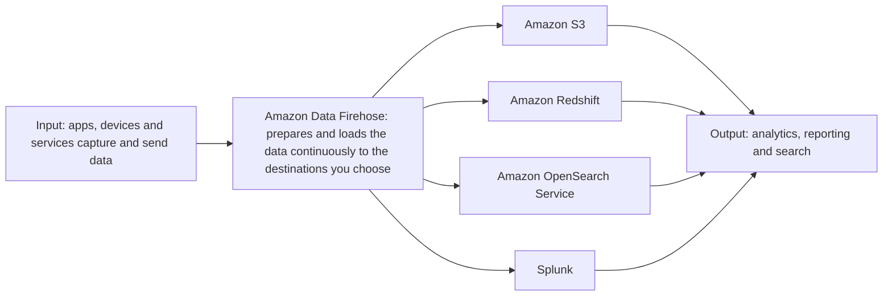
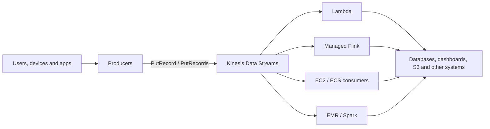
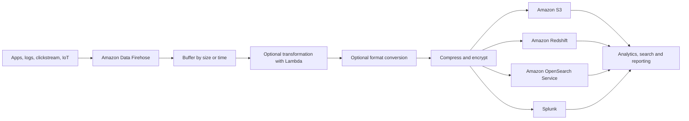
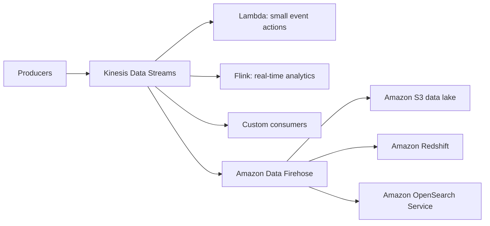
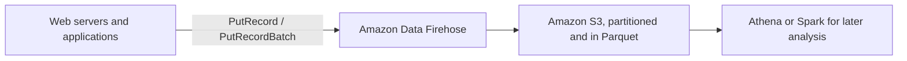
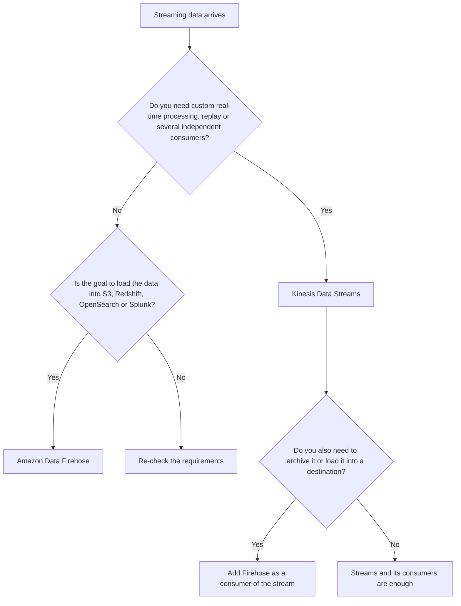

# Kinesis Data Streams vs Amazon Data Firehose

> AWS Certified Big Data - Specialty · Chapter 1: Collection  
> Companion note for **Amazon Kinesis Data Streams** · Part of the [Kinesis notes](README.md) · See also [Choosing a processing engine](KINESIS_PROCESSING_ENGINES.md) · [Tracker](TRACKER.md)  
> Goal: tell the two services apart, draw both architectures, and answer interview and scenario questions at beginner and senior level.

> **A naming update.** *Kinesis Data Firehose* is now called **Amazon Data Firehose**. Older courses, exam material and slides still use the old name. In the slide you shared, the destination "Amazon Elasticsearch Service" is also the old name: it is now **Amazon OpenSearch Service**.

| | |
| --- | --- |
| **1.** [The one-sentence difference](#1-the-one-sentence-difference) | **8.** [Using both together](#8-using-both-together) |
| **2.** [What the Firehose slide shows](#2-what-the-firehose-slide-shows) | **9.** [Real-world scenarios](#9-real-world-scenarios) |
| **3.** [Amazon Data Firehose in simple terms](#3-amazon-data-firehose-in-simple-terms) | **10.** [Scenario-based exercises](#10-scenario-based-exercises) |
| **4.** [Kinesis Data Streams in one page](#4-kinesis-data-streams-in-one-page) | **11.** [Interview questions](#11-interview-questions) |
| **5.** [Side-by-side comparison](#5-side-by-side-comparison) | **12.** [Beginner notes and senior architect notes](#12-beginner-notes-and-senior-architect-notes) |
| **6.** [Architecture diagrams](#6-architecture-diagrams) | **13.** [Quick memory cheat sheet](#13-quick-memory-cheat-sheet) |
| **7.** [When to choose which](#7-when-to-choose-which) | **14.** [Official AWS references](#14-official-aws-references) |

> **How to read the numbers.** AWS limits, features and prices change. Treat figures and feature lists here as approximate, and check the current documentation before designing a real system.

---

## 1. The one-sentence difference

```text
Kinesis Data Streams  =  "I want to PROCESS streaming events in real time, with my own logic."

Amazon Data Firehose  =  "I want to CAPTURE streaming data and DELIVER it to a destination, automatically."
```

<div align="center">
    
</div>

**What you are seeing**

1. **Left, Data Streams.** The producer's events go into a stream that **keeps** them. Three different consumers (Lambda, Flink, your own app) each read the **same events** at their own pace, and a consumer can **replay** earlier events.
2. **Right, Firehose.** The producer's records go into a delivery stream that **buffers** them, optionally transforms and converts them, and then **delivers** a batch to the destinations: S3, Redshift, OpenSearch, Splunk.
3. With Data Streams **you build and run the consumers**. With Firehose **there is nothing to consume**: you read the destination afterwards.

**Two pictures that help**

```text
Data Streams = a streaming bus            Firehose = a delivery truck

event happened                            collect packages
   |                                          |
   v                                          v
stream                                    deliver them automatically
   |                                      to the warehouse
   +--> team A reads
   +--> team B reads
   +--> team C reads
```

The same event can be processed by many systems on the bus. The truck simply takes the data to the warehouse.

---

## 2. What the Firehose slide shows

The slide you shared (from a Kinesis course, "How it works") is explaining **Firehose**, not Data Streams.



In plain words:

- Data comes from apps, devices and services.
- Firehose collects it, **buffers** it, **batches** it and **delivers** it automatically.
- It lands in a destination that is built for analytics, reporting or search.
- Those destinations are then used for the analysis. Firehose itself does not analyse anything.

So Firehose is mainly: **"collect streaming data and automatically load it into destination systems."**

---

## 3. Amazon Data Firehose in simple terms

### The flow

```text
Apps / logs / clickstream / IoT / Kinesis Data Streams
                |
                v
        Amazon Data Firehose
                |
                +--> Buffering
                +--> Optional transformation
                +--> Optional format conversion
                +--> Compression / encryption
                |
                v
        Destinations (S3, Redshift, OpenSearch, Splunk, ...)
                |
                v
        BI / analytics / search / reporting
```

### What Firehose does for you

| Feature | In one line |
| --- | --- |
| **Buffering** | Collects data until a **size** or a **time interval** is reached, then delivers a batch |
| **Transformation** | Optionally runs your **Lambda** function on the records before delivery |
| **Format conversion** | Can convert JSON to **Parquet or ORC** (it needs a schema, for example from the Glue Data Catalog) |
| **Dynamic partitioning** | Can write S3 objects into folders based on the data, such as date or customer |
| **Compression and encryption** | Compress the output and encrypt it with KMS |
| **Retries and backup** | Retries failed deliveries, and can save failed (or all) records to an S3 backup location |
| **Scaling** | Scales automatically within quotas, with no shards for you to manage |

### Sources and destinations

| | Examples |
| --- | --- |
| **Sources** | **Direct PUT** from your application, **Kinesis Data Streams**, Amazon MSK, and AWS services or agents that write logs and events |
| **Destinations** | **Amazon S3**, **Amazon Redshift** (loaded through S3), **Amazon OpenSearch Service**, **Splunk**, Apache Iceberg tables, HTTP endpoints and several third-party tools |

### What Firehose is not

- **Not a processing engine.** Optional Lambda transformation is light, per-record work. It cannot do windows, joins or state.
- **No replay.** Firehose does not keep a stream you can read again. If you need to re-read, the **source** (a Data Stream) or the **S3 archive** is where you replay from.
- **No consumers to attach.** You do not read from Firehose. You read the destination after delivery.
- **One destination per delivery stream.** To feed two destinations you use two delivery streams.
- **Not instant.** Delivery is **near real time**, set by your buffer size and interval: seconds to minutes, not milliseconds.
- **Delivery is at-least-once**, so duplicates are possible and downstream readers should tolerate them.

---

## 4. Kinesis Data Streams in one page

Data Streams is the **streaming bus**: producers write records, the stream keeps them for a retention period, and **any number of consumers** read them independently.

```text
Producer -- PUT --> Kinesis Data Streams <-- GET -- Consumer
```

| Idea | In one line |
| --- | --- |
| **Shards** | The parallel lanes that give the stream its capacity (about 1 MB/s in and 2 MB/s out per shard, approximate) |
| **Partition key** | You choose it; it decides the shard and the ordering |
| **Ordering** | Kept inside a shard, not across shards |
| **Retention and replay** | Records are kept for a configurable period, so consumers can re-read them |
| **Multiple consumers** | Lambda, Flink, your own apps, EMR/Spark can all read the same stream |
| **Enhanced fan-out** | Gives each registered consumer its own read capacity |

The full explanation, with animations, is in the [Kinesis Data Streams notes](README.md).

---

## 5. Side-by-side comparison

| Area | Kinesis Data Streams | Amazon Data Firehose |
| --- | --- | --- |
| **Main purpose** | Real-time stream **processing** | Managed **delivery** to destinations |
| **Control level** | High | Low, simplified |
| **Who reads the data** | Your consumers (many, independent) | Nobody: it is delivered to a destination |
| **Replay** | Yes, within retention | Not like Data Streams (replay from the source or the S3 archive) |
| **Retention** | Configurable period | Not a store you read from |
| **Scaling unit** | Shards (or on-demand capacity) | None for you to manage |
| **Ordering** | Per shard, with partition keys | Not something you control |
| **Processing** | You build it (Lambda, Flink, Spark, your app) | Optional light transform, format conversion |
| **Destinations** | Anything, through consumers | Supported destinations such as S3, Redshift, OpenSearch, Splunk |
| **Typical latency** | Milliseconds to seconds | Seconds to minutes (buffer settings) |
| **Delivery semantics** | At-least-once | At-least-once |
| **Operational effort** | More | Less |
| **Cost model** | Shard-hours (or per GB on-demand) plus data and consumers | Per GB ingested plus options such as conversion |
| **Best for** | Custom streaming applications | Easy ingestion into S3, Redshift and similar |

---

## 6. Architecture diagrams

> The diagrams below are **Mermaid**. GitHub draws them automatically in the browser. If you read this file somewhere that does not render Mermaid, you will see the text of each diagram instead.

### 6.1 Kinesis Data Streams: the streaming bus



**Meaning:** the stream stores events temporarily, several consumers read the **same** event, each processes it independently, replay is possible, and you have a high level of control.

### 6.2 Amazon Data Firehose: the managed delivery pipeline



**Meaning:** Firehose receives the data, buffers it for a short time, optionally transforms it, and delivers it automatically. You do not manage shards or consumers.

### 6.3 Both together



**Meaning:** Data Streams handles the custom, real-time processing. **Firehose is simply one more consumer** of the stream, and it takes care of the easy, reliable delivery to storage and analytics. This is a very common enterprise pattern.

### 6.4 Firehose straight from the producers



**Meaning:** when the only need is to land the data, there is **no Data Stream in the path at all**.

---

## 7. When to choose which

### Choose Kinesis Data Streams when

- you need **custom real-time processing**
- you need **multiple consumers**
- you need **replay**
- you need **shard-level scaling control**
- you need **partition keys and ordering**
- different systems must process **the same event independently**

> **Architect sentence:** use Data Streams when **stream processing** is the problem.

### Choose Firehose when

- you just need to **ingest and deliver** data
- S3, Redshift, OpenSearch or Splunk is the destination
- you want **less operational effort**
- you do not want to manage custom consumers
- **near-real-time** delivery is enough
- you want **buffering, compression or format conversion**

> **Architect sentence:** use Firehose when **stream delivery** is the problem.

### Decision flow



---

## 8. Using both together

Yes, and very commonly.

```text
Producers
   |
   v
Kinesis Data Streams
   |
   +--> Lambda / Flink / custom consumers      (processing)
   |
   +--> Firehose --> S3 / Redshift / OpenSearch (delivery and archive)
```

**Why this works well**

- Streams does what only it can: several independent consumers, ordering per key, replay, custom logic.
- Firehose does what it does best: reliable, managed delivery, buffering and format conversion, **without you writing a consumer**.
- The S3 archive that Firehose builds also becomes your **long-term replay source** after the stream's retention period has passed.

**Two ways to wire Firehose**

| Wiring | Use it when |
| --- | --- |
| **Producers → Firehose directly** | You only need to land the data |
| **Producers → Data Streams → Firehose** | You also need custom processing or several consumers, and want the archive for free |

---

## 9. Real-world scenarios

### Scenario 1: Netflix / Hotstar-style playback events

Users generate `play`, `pause`, `seek`, `buffer_start`, `buffer_end`.

**Better fit: Kinesis Data Streams.** Many teams need the same events, replay may be required, real-time processing is needed, and several independent consumers are involved. Add Firehose to archive the events in S3.

### Scenario 2: Server access logs to S3 for analytics

Web server logs are generated continuously. You want to collect them, store them in S3, and analyse them later in Athena.

**Better fit: Firehose.** Simple ingestion is enough, no custom stream processing is needed, and automatic delivery to S3 is exactly the job.

### Scenario 3: Real-time fraud detection

Events: payment started, payment completed, payment failed, suspicious device activity.

**Better fit: Kinesis Data Streams plus Flink or Lambda.** It needs real-time event processing, custom fraud logic, and probably stateful stream processing.

### Scenario 4: Application telemetry into Redshift

You want telemetry events, easy loading into Redshift, and dashboards later.

**Better fit: Firehose.** The destination is known, delivery is the main need, and it is far simpler than building custom consumers.

---

## 10. Scenario-based exercises

Try each one first, then open the answer.

<details>
<summary><b>E1. Clickstream data only needs to be stored in S3 for later Athena analysis. Which service?</b></summary>

**Firehose.** Simple managed delivery to S3. Add partitioning (date) and Parquet conversion so Athena queries are fast and cheap.

</details>

<details>
<summary><b>E2. A payment platform needs fraud detection, live monitoring, replay and several downstream consumers. Which service?</b></summary>

**Kinesis Data Streams.** It gives several consumers, replay and custom real-time logic (Flink or Lambda). Add Firehose as one more consumer to archive everything to S3.

</details>

<details>
<summary><b>E3. Can Firehose replace Data Streams?</b></summary>

**Not fully.** Firehose is a delivery service. It does not give you custom streaming processing, multiple independent consumers, replay or per-key ordering.

</details>

<details>
<summary><b>E4. Can Firehose use Data Streams as a source?</b></summary>

**Yes.** Data Streams collects and serves the events for processing, and Firehose reads from it to deliver the data to S3, Redshift, OpenSearch and others.

</details>

<details>
<summary><b>E5. You only want logs in S3 with minimal management. Data Streams or Firehose?</b></summary>

**Firehose.** There is nothing to size, no consumers to run, and delivery to S3 is built in.

</details>

<details>
<summary><b>E6. A startup produces only 5,000 small log events per minute. Which would you choose?</b></summary>

That is about 83 events per second, which is tiny. **Firehose to S3.** Data Streams would add shards to size, consumers to write and run, and cost, for no benefit. Revisit only if you later need real-time logic or several consumers.

</details>

<details>
<summary><b>E7. A large e-commerce company needs clickstream replay, multiple consumers, real-time recommendation signals and S3 archival. Design it.</b></summary>

**Data Streams as the hub.** Producers write clickstream events to the stream (partition by user or session). Flink computes the real-time recommendation signals, Lambda handles small reactions, and **Firehose is a consumer** that archives to S3 (partitioned, Parquet) for Athena and Spark. Use enhanced fan-out because several consumers read the same shards, and rely on retention plus the S3 archive for replay.

</details>

<details>
<summary><b>E8. Compliance requires every event to be archived, and fraud alerts must fire within 2 seconds. Design it.</b></summary>

Two paths from one stream. **Alerts:** Data Streams to Flink or Lambda for the low-latency rule. **Archive:** Data Streams to **Firehose** to S3, with encryption and a retention or lock policy on the bucket. The alert path does not wait for the archive, and the archive does not depend on the alert logic.

</details>

<details>
<summary><b>E9. Telemetry must reach Redshift for dashboards. Freshness of 15 minutes is fine and engineering time is scarce.</b></summary>

**Firehose to Redshift.** The destination is known, the freshness target is loose, and Firehose loads through S3 for you. Watch the delivery-freshness metric so you notice when loads fall behind.

</details>

<details>
<summary><b>E10. Three teams need the same events, at different speeds, and one team must re-read the last 3 days after a bug. Which service?</b></summary>

**Data Streams**, with retention of at least 3 days and enhanced fan-out so the teams do not starve each other. Firehose cannot give independent, replayable consumers.

</details>

<details>
<summary><b>E11. Analysts want cheap, fast Athena queries over event data, partitioned by date and customer. How do you build the ingest?</b></summary>

**Firehose** with **format conversion to Parquet** (using a Glue schema), **dynamic partitioning** by date and customer, and sensible buffer settings so the files are not tiny. Compression comes with the format.

</details>

<details>
<summary><b>E12. A working Firehose-to-S3 pipeline now needs running totals per user over the last 10 minutes. What changes?</b></summary>

That is **stateful, windowed processing**, which Firehose cannot do. Put a **Data Stream** in front, add **Flink** for the running totals, and keep Firehose as a consumer for the archive. The producers write to the stream instead of to Firehose directly.

</details>

---

## 11. Interview questions

Tap a question to see the model answer.

### Foundation

<details>
<summary><b>1. What problem does Kinesis Data Streams solve?</b></summary>

It lets applications send a continuous flow of events into a buffer that **keeps them for a while**, so several consumers can process them in real time, independently and with replay, without the producers knowing who reads.

</details>

<details>
<summary><b>2. What problem does Firehose solve?</b></summary>

It captures streaming data and **delivers it automatically** to destinations such as S3, Redshift, OpenSearch and Splunk, with buffering, optional transformation and conversion, and no consumers or shards to manage.

</details>

<details>
<summary><b>3. Why are they not the same service?</b></summary>

They solve different problems. Data Streams is a **processing and distribution layer** with control and replay. Firehose is a **delivery pipeline** with minimal control. One is for building stream applications, the other for loading data.

</details>

<details>
<summary><b>4. When would you choose Firehose over Data Streams?</b></summary>

When the need is just to ingest and deliver data to a supported destination, near real time is enough, and you want the least operational effort.

</details>

<details>
<summary><b>5. When would you choose Data Streams over Firehose?</b></summary>

When you need custom real-time processing, multiple independent consumers, replay, partition keys and ordering, or shard-level control.

</details>

### Architecture

<details>
<summary><b>6. Design a streaming architecture for video playback events.</b></summary>

Producers send `PLAY`, `PAUSE`, `SEEK`, `BUFFER_START`, `BUFFER_END` to **Data Streams**, partitioned by user or session so each session stays in order. **Flink** computes real-time quality metrics, **Lambda** triggers small actions, and **Firehose** archives to S3 for offline analytics.

</details>

<details>
<summary><b>7. Design a log ingestion pipeline into S3 and Redshift.</b></summary>

If there is no custom processing: servers send logs to **Firehose**, which delivers to **S3** (partitioned, Parquet) and loads **Redshift**. Two destinations means two delivery streams (or one delivery stream to S3 and a load from S3). Add a backup bucket for failed deliveries and a freshness alarm.

</details>

<details>
<summary><b>8. Design a fraud detection stream for payment events.</b></summary>

Payment events go to **Data Streams** keyed by card or account. **Flink** keeps per-card windows and state and raises alerts within seconds, **Lambda** can notify, and **Firehose** archives to S3 for audit and model training. Use idempotent alerting so retries do not duplicate actions.

</details>

<details>
<summary><b>9. Where does Lambda fit with Data Streams versus Firehose?</b></summary>

With **Data Streams**, Lambda is a **consumer**: an event source mapping polls the shards and invokes your function with batches. With **Firehose**, Lambda is a **transformer**: Firehose invokes your function on a batch of records before delivery. The same service plays two different roles.

</details>

<details>
<summary><b>10. Explain how Data Streams and Firehose can be combined.</b></summary>

Producers write to a Data Stream. Custom consumers (Lambda, Flink, apps) process it, and **Firehose is attached as one more consumer** that delivers the stream to S3, Redshift or OpenSearch. You get custom processing and easy managed delivery from one stream.

</details>

### Senior architect

<details>
<summary><b>11. A startup generates only 5,000 small log events per minute. Which would you choose and why?</b></summary>

Firehose to S3. About 83 events per second does not justify shards, consumers and their operation. Keep producers writing a stable event format so a Data Stream can be inserted later if real-time needs appear.

</details>

<details>
<summary><b>12. A large e-commerce company needs clickstream replay, multiple consumers, real-time recommendation signals and S3 archival. What do you design?</b></summary>

Data Streams as the hub, Flink for the recommendation signals, Lambda for small actions, Firehose as a consumer archiving to S3 in Parquet, and enhanced fan-out for the readers. See exercise E7.

</details>

<details>
<summary><b>13. Explain the operational trade-offs between Firehose and Data Streams.</b></summary>

Firehose: nothing to size or run, automatic scaling, less control, near-real-time only, no replay. Data Streams: you size shards (or choose on-demand), build and operate consumers, manage lag and hot shards, but you get ordering, replay, fan-out and millisecond-to-second latency. Pick the least control that meets the requirement.

</details>

<details>
<summary><b>14. If data must be available to many teams independently, which service is better and why?</b></summary>

**Data Streams.** Each team gets its own consumer (ideally with enhanced fan-out), reads at its own pace and can replay. Firehose delivers to a destination, so teams would all read the destination afterwards, with no independent real-time access.

</details>

<details>
<summary><b>15. If the only requirement is delivery into Redshift with minimum engineering effort, which service is better?</b></summary>

**Firehose.** It loads Redshift (through S3) for you, with retries and a backup location, and needs no consumer code.

</details>

<details>
<summary><b>16. Why can Firehose produce many small files in S3, and how do you fix it?</b></summary>

Small buffers and low traffic make each delivery small, and dynamic partitioning multiplies the number of prefixes. Fix it with larger buffer size and longer interval, fewer partition keys, and a periodic **compaction** job (for example Spark or Athena) that rewrites small files into larger Parquet files.

</details>

<details>
<summary><b>17. Can Firehose give you exactly-once delivery to S3?</b></summary>

No. Delivery is **at-least-once**, so duplicates are possible. Include a unique event ID and **deduplicate downstream** (in the query or in a compaction job) if duplicates matter.

</details>

<details>
<summary><b>18. What happens when Firehose cannot deliver, for example to Redshift or OpenSearch?</b></summary>

Firehose **retries** for the configured period, then writes the failed records to an **S3 backup (error) location** so nothing is lost silently. You monitor the delivery-freshness and failure metrics, fix the destination, and reload from the backup.

</details>

<details>
<summary><b>19. How do you "replay" in a design that uses Firehose?</b></summary>

Firehose itself cannot replay. If it reads from a **Data Stream**, you replay from the stream within its retention. Beyond that, you replay from the **S3 archive** that Firehose wrote, by reprocessing those files with Spark or Athena.

</details>

<details>
<summary><b>20. Which one do you use if event order matters?</b></summary>

**Data Streams**, with a partition key so the events of one entity share a shard and keep their order. Firehose does not expose ordering semantics you can rely on for processing.

</details>

<details>
<summary><b>21. How do you compare the cost of the two?</b></summary>

Firehose is charged mainly **per GB ingested** (plus options like format conversion), so for pure delivery it is usually the cheaper and simpler choice. Data Streams charges for **capacity** (shard-hours or on-demand per GB) plus the compute for your consumers, but it buys you processing, fan-out and replay. Model both at normal and peak traffic, including consumer compute.

</details>

<details>
<summary><b>22. What security controls apply to a Firehose pipeline?</b></summary>

A least-privilege **IAM role** for each delivery stream, **KMS encryption** at rest, encryption in transit, private connectivity where available, restricted access to the destination bucket or cluster, and audit logging. Treat the delivery stream's role as its own security boundary.

</details>

<details>
<summary><b>23. When does Firehose stop being enough?</b></summary>

When you need state, windows or joins, sub-second or low-seconds latency, several independent consumers, replay, per-key ordering, or custom logic beyond a light per-record transform. At that point put a Data Stream (and a processing engine) in front.

</details>

<details>
<summary><b>24. What would you monitor on each?</b></summary>

**Firehose:** delivery success and data freshness per destination, incoming bytes and records, throttling, transformation errors, and the size of the backup bucket. **Data Streams:** iterator age (lag), incoming and outgoing throughput, throttling, and consumer errors. Alert on freshness and lag, not only on errors.

</details>

<details>
<summary><b>25. Why not use Data Streams for everything?</b></summary>

More control means more to design, size, run and pay for. For a simple "land it in S3" job, Data Streams adds shards, consumers and cost with no benefit. Use the simplest service that meets the requirement.

</details>

---

## 12. Beginner notes and senior architect notes

### Beginner notes

**The five sentences to remember**

1. **Data Streams** is for building real-time stream processing with your own logic.
2. **Firehose** is for delivering streaming data to places like S3 and Redshift.
3. With Data Streams **you** build the consumers. With Firehose **there are no consumers**.
4. Data Streams can **replay**. Firehose cannot.
5. They work well **together**: Data Streams for processing, Firehose for delivery.

**Words to know**

| Word | Meaning |
| --- | --- |
| **Delivery stream** | The Firehose resource that receives data and delivers it |
| **Buffer** | How much data (size) or how long (time) Firehose waits before it delivers a batch |
| **Destination** | Where Firehose delivers: S3, Redshift, OpenSearch, Splunk and so on |
| **Transformation** | A Lambda function Firehose runs on records before delivery |
| **Direct PUT** | Your application writes straight to Firehose |
| **Consumer** | A program that reads from a Data Stream (there is no such thing in Firehose) |

### Senior architect notes

**Design checklist for a delivery or ingest pipeline**

- **Do you need an engine at all?** If the job is "land the data", Firehose is the answer and nothing else is needed.
- **Latency target.** Firehose is near real time, set by buffering. If you need low-seconds or less, you need Data Streams plus a processing engine.
- **Replay strategy.** Decide where replay comes from: stream retention first, the S3 archive after that. Make reprocessing jobs idempotent.
- **File layout.** Choose buffer settings, partitioning and Parquet conversion together so you avoid the small-file problem and keep Athena and Spark fast.
- **Duplicates.** Both services are at-least-once. Carry a unique event ID and deduplicate or write idempotently downstream.
- **Schema.** Use a schema registry or Glue schema, evolve fields compatibly, and decide where invalid records go.
- **Failure handling.** Use backup buckets for failed deliveries and a dead-letter path for bad records, and alarm on them.
- **Fan-out.** More than one reader of the same data points to Data Streams. Check read capacity and consider enhanced fan-out.
- **Ordering.** If per-entity order matters, use Data Streams and a partition key.
- **Security.** Separate roles per pipeline, KMS everywhere, private connectivity, bucket policies and logging.
- **Observability.** Track freshness and lag, delivery success, throttling, transformation errors and backup volume.
- **Cost.** Compare per-GB cost with shard-hour and consumer compute at normal and peak load.
- **Disaster recovery.** Decide the recovery objective, then whether you need a second stream, cross-Region replication of the archive, or both.

**Where this sits among the other choices**

```text
Just land the data            -> Firehose
Process one event at a time   -> Data Streams + Lambda
Windows, state, joins         -> Data Streams + Flink
Heavy batch over history      -> S3 archive + Spark / EMR
```

See [Choosing a processing engine](KINESIS_PROCESSING_ENGINES.md) for the engine decision in detail.

---

## 13. Quick memory cheat sheet

```text
Kinesis Data Streams = process the stream
Amazon Data Firehose = deliver the stream

Data Streams = brains and control
Firehose     = managed pipeline to a destination
```

```text
Input --> Firehose     --> S3 / Redshift / OpenSearch / Splunk --> Analytics
Input --> Data Streams --> Lambda / Flink / EC2 / Spark         --> Output systems
```

| Question | Answer |
| --- | --- |
| Many independent consumers? | Data Streams |
| Replay? | Data Streams |
| Custom real-time logic? | Data Streams |
| Just land it in S3 or Redshift? | Firehose |
| Least operational effort? | Firehose |
| Both? | Data Streams, with Firehose as a consumer |

---

## 14. Official AWS references

- [What is Amazon Data Firehose?](https://docs.aws.amazon.com/firehose/latest/dev/what-is-this-service.html)
- [Understanding Firehose delivery](https://docs.aws.amazon.com/firehose/latest/dev/basic-deliver.html)
- [Transforming source data with Lambda](https://docs.aws.amazon.com/firehose/latest/dev/data-transformation.html)
- [Converting record format (Parquet and ORC)](https://docs.aws.amazon.com/firehose/latest/dev/record-format-conversion.html)
- [Dynamic partitioning](https://docs.aws.amazon.com/firehose/latest/dev/dynamic-partitioning.html)
- [Controlling access with Firehose](https://docs.aws.amazon.com/firehose/latest/dev/controlling-access.html)
- [Monitoring Firehose with CloudWatch metrics](https://docs.aws.amazon.com/firehose/latest/dev/monitoring-with-cloudwatch-metrics.html)
- [Kinesis Data Streams developer guide](https://docs.aws.amazon.com/streams/latest/dev/introduction.html)
