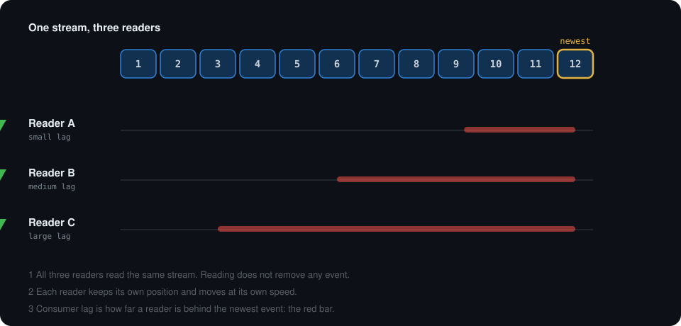

# Amazon Kinesis Data Streams

> AWS Certified Big Data - Specialty · Chapter 1: Collection · Topic 1 of 7 · [See the learning tracker](TRACKER.md)

**In this notebook you will learn:**

- What problem Kinesis Data Streams solves, and when you do not need it
- The core terms: Producer, Record, Stream, Shard, Partition Key, Sequence Number, Consumer
- How ordering, capacity, retention and replay work
- How data is written (PutRecord, PutRecords) and read (consumer lag, standard and enhanced fan-out)

Every concept has a small animated diagram and a "what you are seeing" walkthrough, and ends with questions to check yourself.

| | |
| --- | --- |
| **1.** [What problem does Kinesis solve?](#1-what-problem-does-kinesis-solve) | **7.** [Capacity and scaling](#7-capacity-and-scaling) |
| **2.** [Basic Kinesis flow](#2-basic-kinesis-flow) | **8.** [Writing data: PutRecord and PutRecords](#8-writing-data-putrecord-and-putrecords) |
| **3.** [Simple example](#3-simple-example) | **9.** [Retention and replay](#9-retention-and-replay) |
| **4.** [Do you always need Kinesis?](#4-do-you-always-need-kinesis) | **10.** [Reading data](#10-reading-data) |
| **5.** [Core terminology](#5-core-terminology) | **11.** [The full picture](#11-the-full-picture) |
| **6.** [Ordering](#6-ordering) | **12.** [What is still to learn](#12-what-is-still-to-learn) |

---

## 1. What problem does Kinesis solve?

Applications continuously generate data.

Examples:

- User login
- Website click
- Payment
- Application log
- IoT sensor event

These events do not arrive once a day in a neat file. They arrive all the time, often many per second.

Somebody else usually needs this data: a dashboard, an alert system, a database. But if the application sends every event straight to that system, problems appear:

- If the receiving system is slow or down, **events can be lost**.
- The application must **know about every system** that wants the data.
- A sudden burst of events can **overwhelm** the receiver.

**Kinesis Data Streams** sits in the middle. It collects these events in real time and **keeps them for a while**, so other programs can read them when they are ready.

Think of a conveyor belt in a factory: items are placed on one end, and workers pick them up from the belt when they are ready.

---

## 2. Basic Kinesis flow

A **Producer** sends data into Kinesis.

A **Consumer** reads data from Kinesis.

<div align="center">
    
</div>

```text
Producer -- PUT --> Kinesis <-- GET -- Consumer
```

### PUT

`PUT` means: **send / write** data into Kinesis.

```text
Application
    |
    | PUT
    v
Kinesis
```

### GET

`GET` means: **read** data from Kinesis.

```text
Kinesis
    ^
    | GET
    |
Consumer
```

### Who starts the request?

The important point: **the Consumer starts the GET request.**

Normally, Kinesis does not push the events to the Consumer on its own. The Consumer asks, and Kinesis answers with the events. That is why the arrow points from the Consumer **to** Kinesis. The arrows show the direction of the **request**:

```text
Producer -- PUT --> Kinesis <-- GET -- Consumer
```

| | Who starts it | What happens |
| --- | --- | --- |
| **PUT** | Producer | The Producer writes data into Kinesis |
| **GET** | Consumer | The Consumer asks Kinesis, and the events come back to the Consumer |

> **Remember:** PUT = Producer writes. GET = Consumer reads.

---

## 3. Simple example

A customer logs in to an application.

<div align="center">
    
</div>

```text
Customer
   |
   v
Application
   |
   | PUT login event
   v
Kinesis
   ^
   | GET login event
   |
Consumer
```

Step by step:

1. The **customer** logs in to the application.
2. The **application** (the Producer) **PUTs** a login event into Kinesis.
3. **Kinesis keeps the event** until a Consumer processes it.
4. A **Consumer GETs** the login event and processes it, for example to count logins or look for suspicious activity.

Kinesis sits between the Producer and the Consumer. It temporarily keeps the event until Consumers process it. The application does not need to know who the Consumers are, and it does not need to wait for them.

---

### Check yourself: sections 1 to 3

<details>
<summary><b>Which side starts a PUT?</b></summary>

The Producer. It writes data into Kinesis.

</details>

<details>
<summary><b>Which side starts a GET?</b></summary>

The Consumer. It asks Kinesis for data, and the events come back to it.

</details>

<details>
<summary><b>Why put Kinesis between the application and the system that processes the events?</b></summary>

Kinesis keeps the events for a while. The application can keep sending even if the processing system is slow, and the application does not need to know who reads the data.

</details>

---

## 4. Do you always need Kinesis?

No. Kinesis is a useful tool, not a rule. This section is about knowing **when it helps and when it does not**.

### 4.1 Writing straight to a database is possible

```text
Application --> MongoDB
```

This is completely possible. Kinesis is **not mandatory** just because data arrives continuously. A transactional database such as MongoDB can take events directly.

So the real question is not "can I?" but "should I?".

### 4.2 Current state or event flow?

A transactional database and an event stream keep different things.

```text
MongoDB  = operational / current state    ("where things stand now")
Kinesis  = event flow                     ("what happened, in order")
```

Example: a video player.

```text
MongoDB:   current playback position = 32:15

Kinesis:   PLAY
           PAUSE
           SEEK
           BUFFER_START
           BUFFER_END
```

<div align="center">
    
</div>

**What you are seeing**

1. The video player produces events: `PLAY`, `PAUSE`, `SEEK`, `BUFFER_START`, `BUFFER_END`.
2. **Kinesis** adds each event to the stream, so every event is kept, in order.
3. **MongoDB** overwrites a single value, the current playback position. The old values are gone.
4. Events tell the whole story. State tells you where things stand right now.

### 4.3 Why not just use MongoDB?

<details>
<summary><b>❓ A fair question: "MongoDB can already do all of this. Why add Kinesis?"</b></summary>

You are right to ask. MongoDB can:

- handle multiple readers
- serve multiple systems
- scale
- store event data
- support querying

Kinesis becomes more attractive when:

- the **event volume becomes very large**
- you want to **reduce read and write pressure** on the transactional database
- you want a **dedicated streaming layer**
- **multiple systems** need to process the events continuously

Start simple. Add a stream when one of these problems is real, not before.

</details>

### 4.4 Independent processing

Different readers can process the same stream at different speeds. Each one moves on its own.

```text
Reader A -> event 1000
Reader B -> event 850
Reader C -> event 700
```

You will see this animated in [section 10.2](#102-consumer-lag).

### Check yourself: section 4

<details>
<summary><b>Can an application write events straight into MongoDB?</b></summary>

Yes. It is completely possible, and Kinesis is not mandatory.

</details>

<details>
<summary><b>What is the difference between a transactional database and an event stream?</b></summary>

The database keeps the **current state**: where things stand now. The stream keeps the **flow of events**: what happened, in order.

</details>

<details>
<summary><b>When does Kinesis become more attractive than writing straight to the database?</b></summary>

When the event volume is very large, when you want less read/write pressure on the transactional database, when you want a dedicated streaming layer, or when several systems need to process the events continuously.

</details>

<details>
<summary><b>Can two readers process the same stream at different speeds?</b></summary>

Yes. Each reader keeps its own position and moves independently.

</details>

---

## 5. Core terminology

Seven terms, one at a time.

### 5.1 Producer

A **Producer** is an application or service that **sends records to Kinesis**.

```text
Web application  -- PUT -->  Kinesis
```

Examples: a website sending click events, a payment service sending payment events, a sensor gateway sending readings.

### 5.2 Record

A **Record** is **one individual event / data item**.

```text
{ "event": "login", "user": "user-A" }      <- one record
{ "event": "click", "user": "user-B" }      <- another record
```

You send records into Kinesis, Kinesis keeps records, and consumers read records. A record is the unit of data.

### 5.3 Stream

A **Stream** is the Kinesis resource that **receives and holds records temporarily**. It is the "conveyor belt" from section 1. A stream is made of shards.

### 5.4 Shard

A **Shard** is **one parallel lane inside a stream**.

```text
Stream
  |-- Shard 1
  |-- Shard 2
  |-- Shard 3
```

Several lanes mean several records can be handled at the same time. How much each lane can carry is covered in [section 7](#7-capacity-and-scaling).

### 5.5 Partition key

The **Partition Key** is a **routing value** that decides **which shard gets a record**.

- **You choose the key.** For example `user-A`.
- **Kinesis chooses the shard** from that key.
- **The same key always goes to the same shard.**

<div align="center">
    
</div>

**What you are seeing**

1. The Producer sends records, each with a partition key: `user-A` (blue), `user-B` (orange), `user-C` (green).
2. The partition key decides the route. You chose the key, and Kinesis picks the shard.
3. Every `user-A` record lands in **Shard 1**, every `user-B` record in **Shard 2**, every `user-C` record in **Shard 3**.
4. Inside each shard, the records get numbered in the order they arrive: `#1`, `#2`, `#3`.

### 5.6 Sequence number

A **Sequence Number** is **assigned by Kinesis** to a record **inside a shard**. It shows the record's **position / order within that shard**.

You do not choose it. In the animation above, `#1`, `#2`, `#3` are the order of arrival in each shard.

### 5.7 Consumer

A **Consumer** is a downstream system that **reads records from Kinesis**: for example a dashboard, an alert system or a program that stores the data. How consumers read is covered in [section 10](#10-reading-data).

### Terms at a glance

| Term | One-line meaning | Who controls it |
| --- | --- | --- |
| **Producer** | Sends records into Kinesis | You |
| **Record** | One individual event / data item | You |
| **Stream** | Receives and holds records temporarily | You create it |
| **Shard** | One parallel lane inside a stream | You (provisioned) or AWS (on-demand) |
| **Partition key** | Routing value that picks the shard | You choose the key |
| **Sequence number** | Position of a record inside a shard | Kinesis |
| **Consumer** | Reads records from Kinesis | You |

### Check yourself: section 5

<details>
<summary><b>Who chooses the partition key, and who chooses the shard?</b></summary>

You choose the key. Kinesis chooses the shard from the key.

</details>

<details>
<summary><b>What does a sequence number tell you?</b></summary>

The position (order) of a record inside its shard. Kinesis assigns it.

</details>

<details>
<summary><b>What is a shard?</b></summary>

One parallel lane inside a stream.

</details>

<details>
<summary><b>Can two different partition keys end up in the same shard?</b></summary>

Yes. Several keys can share a shard. What never happens is the same key being spread over different shards.

</details>

---

## 6. Ordering

Kinesis keeps records **in order inside one shard**. It does **not** keep them in order across all shards.

<div align="center">
    
</div>

**What you are seeing**

1. At the top, records arrive in real time: A, B, A, C, B, A.
2. Each record drops into the shard chosen by its partition key.
3. **Inside a shard**, the records stay in the order they arrived: `key A #1`, `#2`, `#3`.
4. **Between shards** there is no order guarantee. Kinesis does not promise that `key B #1` is read before or after `key A #2`.

```text
Ordering is preserved:      within a shard
Ordering is NOT preserved:  globally, across all shards
```

**How the partition key helps.** Records with the same key go to the same shard, so **the records for one key stay in order**. If you need all events of one user in order, use the user as the partition key.

### Check yourself: section 6

<details>
<summary><b>Where does Kinesis preserve ordering?</b></summary>

Inside a single shard.

</details>

<details>
<summary><b>Why is there no global order?</b></summary>

Each shard is a separate lane. Kinesis does not compare the order of records that sit in different lanes.

</details>

<details>
<summary><b>How do you keep all the events of one user in order?</b></summary>

Give them all the same partition key, for example the user id. They then land in the same shard, which keeps their order.

</details>

---

## 7. Capacity and scaling

### 7.1 Provisioned or on-demand

| Mode | Who manages shard capacity? |
| --- | --- |
| **Provisioned** | **You.** You decide how many shards the stream has. |
| **On-demand** | **AWS.** AWS manages the scaling for you. |

### 7.2 Shard capacity

Each shard can handle roughly:

| Direction | Capacity per shard (approximate) |
| --- | --- |
| **Writes in** | around **1 MB/s** and around **1,000 records/s** |
| **Reads out** | around **2 MB/s** |

More shards means more total capacity, because the lanes work in parallel. These numbers are approximate: check the current AWS limits before sizing a real system.

### 7.3 Throttling

What if a producer sends more than a shard can take? The shard cannot accept everything, so the extra writes can be **rejected**. This is called **throttling**. The producer should **retry** the rejected records.

<div align="center">
    
</div>

**What you are seeing**

1. **Normal traffic.** Blue records arrive, the write-load bar rises a little, and every write is accepted.
2. **A burst.** Many records arrive at once and the bar fills up and turns red. The shard is full.
3. **Throttled.** The last records bounce back as rejected (red).
4. **Retry.** The producer sends the rejected records again (amber). The load has dropped, so they are accepted.

### Check yourself: section 7

<details>
<summary><b>What is the difference between provisioned and on-demand?</b></summary>

Provisioned: you manage the shard capacity. On-demand: AWS manages the scaling.

</details>

<details>
<summary><b>Roughly how much can one shard take for writes and for reads?</b></summary>

Writes: around 1 MB/s and 1,000 records/s. Reads: around 2 MB/s.

</details>

<details>
<summary><b>What happens when a producer sends more than a shard can accept?</b></summary>

The extra writes can be rejected (throttled). The producer should retry the rejected records.

</details>

---

## 8. Writing data: PutRecord and PutRecords

There are two ways to send records.

| | Sends | Good to know |
| --- | --- | --- |
| **PutRecord** | **One** record per call | Simple, but many calls if you have many records |
| **PutRecords** | A **batch** of records in one call | Fewer calls, but **partial failures** are possible |

<div align="center">
    
</div>

**What you are seeing**

1. **PutRecord** (top lane): three separate calls, each carrying one record.
2. **PutRecords** (bottom lane): one call carrying five records.
3. **The answer comes back** with a result for each record: four succeeded (green), one failed (red). The call itself worked, but one record inside the batch did not. This is a **partial failure**.
4. **Retry only the failed record.** The producer sends that one record again, and it is accepted. It does not resend the whole batch.

### Check yourself: section 8

<details>
<summary><b>What is the difference between PutRecord and PutRecords?</b></summary>

PutRecord sends one record per call. PutRecords sends a batch of records in one call.

</details>

<details>
<summary><b>Can a PutRecords call partly fail?</b></summary>

Yes. The call can succeed while some of the records inside it fail.

</details>

<details>
<summary><b>What should the producer retry after a partial failure?</b></summary>

Only the records that failed, not the whole batch.

</details>

---

## 9. Retention and replay

### Retention

**Retention** is **how long Kinesis keeps records available**. After the retention period, a record is no longer available in Kinesis.

```text
record written ----------------------> retention period ends
                                         |
                                         v
                              record -> no longer available in Kinesis
```

### Replay

**Replay** means **reading retained records again**, starting from an earlier point. A movie is a good picture for it.

```text
Already watched up to minute 15.

Continue:   minute 15 -> onward
Replay:     minute  0 -> onward again
```

Three things to remember:

- Replay is **not a separate ON/OFF setting**.
- Replay **depends on the retained data still being there**.
- **Reading does not delete** a record.

<div align="center">
    
</div>

**What you are seeing**

1. New records arrive on the right (11, 12, 13, 14). Kinesis keeps each one for the retention period, shown by the green dashed window.
2. As time passes, the oldest records (3, 4, 5, 6) fall out of the window. They **expire** and are gone from Kinesis.
3. The amber triangle is the consumer's position. It reads forward as new records arrive.
4. **Replay:** the consumer jumps back to an earlier record that is still kept (record 7) and reads forward again.
5. It cannot jump back to record 3: that record has **expired**, so it cannot be replayed.

The exact length of the retention period, and how to recover after a consumer failure, come later in the roadmap.

### Check yourself: section 9

<details>
<summary><b>What is retention?</b></summary>

How long Kinesis keeps records available. After that, the records are no longer available in Kinesis.

</details>

<details>
<summary><b>What is replay?</b></summary>

Reading retained records again, starting from an earlier point.

</details>

<details>
<summary><b>Does reading a record delete it?</b></summary>

No. Reading does not delete the record, which is why replay is possible.

</details>

<details>
<summary><b>Can you replay a record that has already expired?</b></summary>

No. Replay only works for records that are still retained.

</details>

---

## 10. Reading data

### 10.1 Consumer-side reading

A downstream system **reads records from Kinesis**. With standard consumers, **the consumer starts the request**: it asks, and Kinesis answers with the records. This is the `GET` from [section 2](#2-basic-kinesis-flow).

### 10.2 Consumer lag

Every reader keeps **its own position** in the stream. **Consumer lag** is **how far a reader is behind the newest events**.

<div align="center">
    
</div>

**What you are seeing**

1. Twelve events sit in the stream, and event 12 is the newest.
2. **Reader A** (green triangle) is almost up to date: a small lag.
3. **Reader B** is further back: a medium lag.
4. **Reader C** is far behind: a large lag.
5. The **red bar** is the lag: the distance between a reader and the newest event. Each reader moves at its own speed, and none of them removes any event.

A growing lag means the reader is not keeping up with the producers.

### 10.3 Standard consumers and enhanced fan-out

| | Standard consumer | Enhanced fan-out |
| --- | --- | --- |
| **Read capacity** | Readers **share** the shard's read capacity | **Each registered consumer** gets its own dedicated read capacity |
| **Effect of more consumers** | Each one gets a smaller slice | They do not slow each other down |
| **Who starts the read?** | The consumer asks | Kinesis pushes the records to the consumer |

<div align="center">
    
</div>

**What you are seeing**

1. **Left, standard.** One shard has one read pipe of around 2 MB/s. Three consumers share it, so each gets a smaller slice (fewer dots reach each one).
2. **Right, enhanced fan-out.** The same shard has a separate dedicated pipe for each registered consumer, each around 2 MB/s. Every consumer gets a full stream of dots.

This is the "normally" from section 2: with standard consumers the consumer asks for the records, while with enhanced fan-out Kinesis pushes them.

### Check yourself: section 10

<details>
<summary><b>With standard consumers, who starts the read?</b></summary>

The consumer. It asks Kinesis for records.

</details>

<details>
<summary><b>What is consumer lag?</b></summary>

How far a reader is behind the newest events in the stream.

</details>

<details>
<summary><b>What is the difference between standard consumers and enhanced fan-out?</b></summary>

Standard consumers share a shard's read capacity. With enhanced fan-out each registered consumer gets its own dedicated read capacity.

</details>

---

## 11. The full picture

Putting everything so far in one flow.

```text
User Action
    |
    v
Application / Producer
    |
    | PutRecord / PutRecords
    v
Kinesis Stream
    |
    +--> Shard 1
    +--> Shard 2
    +--> Shard 3
           ^
           |
     Partition Key
     decides routing

Inside each shard:
Record -> Sequence Number -> Ordering

Consumers:
Standard Consumer
or
Enhanced Fan-Out
```

<div align="center">
    
</div>

**What you are seeing**

1. A **user action** reaches the application. The application is the **Producer**.
2. The Producer sends records with `PutRecord` or `PutRecords`, each with a **partition key**.
3. The partition key **routes** each record to a shard (blue, orange and green records go to their own shards). Each shard gives its records **sequence numbers**.
4. **Consumers** read the records. The **standard** consumer asks with `GET`. The **enhanced fan-out** consumer has dedicated capacity and records are **pushed** to it.

---

## 12. What is still to learn

| Topic | Why it matters |
| --- | --- |
| Hot shard and bad partition keys | Connects directly to shard capacity and partition keys |
| Resharding, split shard, merge shard | How a stream grows and shrinks |
| Consumer checkpoints and the Kinesis Client Library (KCL) | How readers remember where they stopped |
| Lambda with Kinesis | A very common real-world consumer |
| Retry and duplicate processing, idempotency | Making failures safe |
| CloudWatch monitoring | Seeing problems early |
| IAM and KMS security | Access and encryption |
| Kinesis vs SQS, Kinesis vs Firehose | Choosing the right service |
| Real production architecture, hands-on build | Putting it all together |

The next best topic is **hot shard and bad partition keys**, because it builds directly on the shard capacity and partition keys you already know. Progress is tracked in the [learning tracker](TRACKER.md).
