# Amazon Kinesis Data Streams

> Chapter 1 · Collection · Topic 1 of 7

**In this part you will learn:**

- What problem Kinesis Data Streams solves
- What `PUT` and `GET` mean, and who starts each one
- How a simple real-life example flows through Kinesis

---

## 1. What problem does Kinesis solve?

Applications continuously generate data.

Examples:

- User login
- Website click
- Payment
- Application log
- IoT sensor event

These events do not arrive once a day in a neat file. They arrive all the time, often many per second.

Somebody else usually needs this data: a dashboard, an alert system, a database. But if the application sends every event straight to that system, problems appear:

- If the receiving system is slow or down, **events can be lost**.
- The application must **know about every system** that wants the data.
- A sudden burst of events can **overwhelm** the receiver.

**Kinesis Data Streams** sits in the middle. It collects these events in real time and **keeps them for a while**, so other programs can read them when they are ready.

Think of a conveyor belt in a factory: items are placed on one end, and workers pick them up from the belt when they are ready.

---

## 2. Basic Kinesis flow

A **Producer** sends data into Kinesis.

A **Consumer** reads data from Kinesis.

<div align="center">
    
</div>

```text
Producer -- PUT --> Kinesis <-- GET -- Consumer
```

### PUT

`PUT` means: **send / write** data into Kinesis.

```text
Application
    |
    | PUT
    v
Kinesis
```

### GET

`GET` means: **read** data from Kinesis.

```text
Kinesis
    ^
    | GET
    |
Consumer
```

### Who starts the request?

The important point: **the Consumer starts the GET request.**

Kinesis does not push the events to the Consumer on its own. The Consumer asks, and Kinesis answers with the events. That is why the arrow points from the Consumer **to** Kinesis. The arrows show the direction of the **request**:

```text
Producer -- PUT --> Kinesis <-- GET -- Consumer
```

| | Who starts it | What happens |
| --- | --- | --- |
| **PUT** | Producer | The Producer writes data into Kinesis |
| **GET** | Consumer | The Consumer asks Kinesis, and the events come back to the Consumer |

> **Remember:** PUT = Producer writes. GET = Consumer reads.

---

## 3. Simple example

A customer logs in to an application.

<div align="center">
    
</div>

```text
Customer
   |
   v
Application
   |
   | PUT login event
   v
Kinesis
   ^
   | GET login event
   |
Consumer
```

Step by step:

1. The **customer** logs in to the application.
2. The **application** (the Producer) **PUTs** a login event into Kinesis.
3. **Kinesis keeps the event** until a Consumer processes it.
4. A **Consumer GETs** the login event and processes it, for example to count logins or look for suspicious activity.

Kinesis sits between the Producer and the Consumer. It temporarily keeps the event until Consumers process it. The application does not need to know who the Consumers are, and it does not need to wait for them.

---

## Check yourself

<details>
<summary><b>1. Which side starts a PUT?</b></summary>

The Producer. It writes data into Kinesis.

</details>

<details>
<summary><b>2. Which side starts a GET?</b></summary>

The Consumer. It asks Kinesis for data, and the events come back to it.

</details>

<details>
<summary><b>3. Why put Kinesis between the application and the system that processes the events?</b></summary>

Kinesis keeps the events for a while. The application can keep sending even if the processing system is slow, and the application does not need to know who reads the data.

</details>
